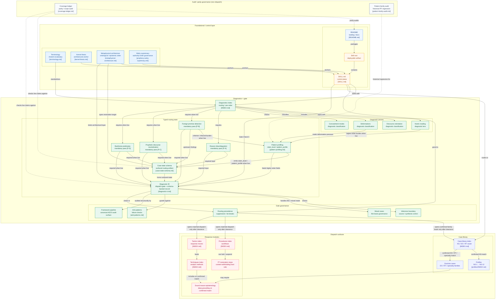

# daee-epistemics

`daee-epistemics` is a modular LLM skill and governed diagnostic framework for epistemic operations and noetic analysis: analogous to a cognitive-security framework for classifying discourse, diagnosing Orientation, Deformation, and Concealment, and routing engagements through matched Tactics, Techniques, Procedures, and Case Modules.

This repository is organized as a GitHub landing page plus a self-contained skill package under [`skill/`](skill/). 

The package is grounded in the coherence and convergence of a common sense account of sound reason, the *fiṭrah* (the innate normative disposition toward truth), and revelation. 
It is designed to examine the condition of the *qalb* (heart-mind) and the *ʿaql* (intellect or reason) before replying to doubts, objections, and worldview conflicts. 
Its governing aim is not to manufacture novelty or simply accumulate clever refutations, but to restore sound cognition so that foundational knowledge, inference, testimony, signs, and revelation are encountered in their proper order.

> Release scope for `v0.1.0.1`: this patch release preserves the bounded initial-release scope while correcting concealment-routing and output-composition behavior around worldview-deflection / pseudo-neutrality cases. It is not a `1.0` completeness claim, not an exhaustive implementation of every later-volume or bespoke comparative family, and not a full specialist manual for every downstream domain. Bounded remaining gaps stay tracked in [`skill/references/diagnostics/coverage-ledger.md`](skill/references/diagnostics/coverage-ledger.md).

## Table of Contents
- [Before You Use This Skill](#before-you-use-this-skill)
- [Terminology Note](#terminology-note)
- [Core Thesis](#core-thesis)
- [Why This Framing Fits the Repository](#why-this-framing-fits-the-repository)
- [What the Skill Protects](#what-the-skill-protects)
- [Threat Model](#threat-model)
- [Operational Governance](#operational-governance)
- [Integration Boundary](#integration-boundary)
- [Repository Architecture](#repository-architecture)
- [Repository Diagram](#repository-diagram)
- [Install / Package for Claude](#install--package-for-claude)

## Before You Use This Skill
The skill needs a practitioner whose own *fiṭrah* is in reasonable health.

Obstacles to clear:
- *bidʿī ʿaqlī* (contaminated rationality)
- *bidʿī naqlī* (corrupted transmission)

The diagnostic faculty is subject to the same taxonomy it applies. 

The skill identifies in interlocutors seven deformations of the *fiṭrah* — 
- *iʿtiqādāt mawrūtha* (inherited beliefs)
- *hawā* (whim, preconceived bias, or stubbornly clinging to personal opinion in the face of countervailing evidence)
- *ẓann* (conjecture)
- *taqlīd* (blind imitation)
- *ʿāda* (unreflective habit)
- *gharaḍ* (ulterior motive or vested interest)
- *shubhah* (doubt or misgivings)

A practitioner's diagnostic reads are only as reliable as the health of the practitioner's own noetic structure. 
A practitioner operating under *hawā* (will dug in), *gharaḍ* (something at stake), or *iʿtiqādāt mawrūtha* (invisible inherited filters) will produce reads contaminated by those deformations — and will execute every downstream tactic on the basis of those reads. The procedure does not fix a deformed faculty; it inherits its condition.

The skill is ordered toward restoration, not performance. 
The standpoint stated in §I — removal of occlusion, not construction of novelty; the task of reminder and restoration, not of winning — applies to the practitioner first. 
Using this skill as a debating instrument, a credential, or a means of forcing verbal concession is itself a deformation: *gharaḍ* or *hawā* operating in the practitioner rather than in the interlocutor.
The character note in §I is not decorative. 
"The absence of defensiveness, the quality of genuine listening" are epistemically constitutive — they are part of what makes the engagement reach where argument cannot, especially where doubt is entangled with damaged trust or bad religious experience.

The symmetric check applies inward before outward. 
`references/tactics/symmetric-taqlid-check.md` exists for a reason: an atheism absorbed from one's intellectual environment without genuine investigation is *taqlīd*, and so is a theism held by convention without genuine examination. Before deploying V7 against an interlocutor's assumed-by-default skepticism, the practitioner should have applied the same check to their own positions. The practitioner who holds their own commitments by *taqlīd* rather than *taḥqīq* has no standing to press the outward check. 
This is not a one-time gate — it is a standing discipline, because *iʿtiqādāt mawrūtha* can reestablish itself and *ʿāda* deepens with time.

The tool can assist getting there. 
The skill's diagnostic vocabulary — Deformation Types, Discourse Orientation, Noetic Structure across the nine analytical dimensions — is available for self-application. A practitioner who suspects their own reads are contaminated can run the noetic reading checklist and the seven deformations taxonomy on themselves, not only on interlocutors. 
Dimension 8 (discourse orientation) is especially apt: determine whether your own engagement is ordered toward truth and warrant, or toward identity-performance or vested outcome. This is a feature of the architecture, not an afterthought — the same instruments that produce a structured diagnostic of an interlocutor's noetic structure can produce one of the practitioner's own.

## Terminology Note

The repository uses Arabic and philosophical vocabulary because the framework itself is articulated in those terms. 
For fuller definitions, see [`references/terminology.md`](skill/references/terminology.md).

Readers unfamiliar with the vocabulary should treat these terms as named components of the framework. 
The repository's own method requires clarity before response, and that applies to terminology as well.

## Core Thesis

> `daee-epistemics` is best understood as analogous to an epistemic SOC: 
a structured system for identifying, classifying, and remediating epistemic distortion affecting the heart-mind.

The point of that analogy is architectural (onboarding-oriented), not ornamental. 

More fundamentally, the skill is attempting to formalise not only the handling of cases within the domain, but the domain’s own **epistemology, noetic analysis, diagnostic ontology, and meta-level grammar** by which cases are subjected to **first-order analysis, higher-order diagnosis, case-typing, routing, interpretation, and restoration**.

The skill covers a governed diagnostic and restorative framework for epistemological, ontological, metaphysical, theological, and related philosophical cases, while also formalising the meta-level grammar by which such cases are typed, routed, interpreted, and restored. 
It aims to externalise the domain’s diagnostic ontology into a compact DSL/IR so that both higher-order diagnosis and first-order analysis become explicit, auditable, and reusable. 
This means the encode/decode not just of answers, but the operative ontology of epistemic states, noetic structures and deformations, and restoration transitions: 
what kind of case is present, 
what level it is operating at, 
what is being smuggled or conflated, 
what must be clarified first, 
what routing follows, and 
how a case moves from deformation toward restored order.

In that sense, the framework is not just organising content; it is formalising a meta-epistemology and an operative map of noetic, epistemic, ontological, and meta-level states and transitions. That makes the system more deterministic at runtime, more portable across models, more compressible across context windows, and potentially usable not only as reference material but as a training grammar for diagnosis, analysis, and restoration.

This makes it desirable for both frontier and quantised LLMs, though for different reasons. 
For frontier models, it functions as external discipline: it reduces drift, forces explicit case-typing and routing, and makes outputs more auditable and reproducible rather than leaving the model to generate persuasive but structurally ungoverned prose. 
For quantised or smaller models, it functions as external cognitive compression: instead of having to internally reconstruct the whole domain at full resolution, the model can operate through a compact case language, typed state, and bounded restoration grammar.

In both cases, the point is the same: to shift the burden from vague latent improvisation toward a portable, inspectable, and reusable structure for diagnosis, analysis, and restoration.

The cognitive-security / epistemic-SOC analogy is helpful here as an onboarding frame, but it is secondary.

A Security Operations Center (SOC) does not begin by deploying countermeasures blindly; it initiates:
* intake
* triage
* classification
* root-cause analysis
* response selection. 

This repository applies a comparable logic to theological and philosophical engagement. 
It treats an objection not merely as a proposition to rebut, but as an event arising within a wider *noetic structure* (the underlying structure of how a person knows, trusts, reasons, and proportions belief).

Not a storehouse of arguments; this is a cognitive-security and diagnostic-response framework for epistemic compromise. 
Its aim is restorative: to clear occlusion, reorder cognition, and return the person to sound perception of truth rather than to construct belief from nothing.

## Why This Framing Fits the Repository

A SOC needs an inventory of systems and dependencies. In this skill, **Noetic Structure** functions like that inventory, as an asset map.

It maps:
* what the person takes as basic
* what they think counts as evidence
* whether their commitments are foundational or derivative
* how they proportion assent
* what they trust as testimony
* what inferential norms they presuppose
* what distortions are already upstream

So, noetic structure is not just "their worldview"; it is more like the **ontology of their epistemic operating environment.**

The repository begins with diagnosis before rebuttal. 
[`SKILL.md`](skill/SKILL.md) instructs the practitioner to identify input type, epistemological position, mode of concealment, deformation, and discourse orientation before selecting any deeper module. 
That posture is the opposite of generic polemics, which often move straight to proposition-level refutation.

This matters because the framework treats falsehood as more than a bad conclusion. 
It also tracks compromised process: 
* inherited priors presented as neutral defaults
* malformed evidential standards
* grief operating as epistemic fog
* socially reinforced habits of discourse
* volitional resistance masquerading as pure rationality. 

A formally correct argument can fail if it is given to the wrong kind of case.

For that reason, the repository routes engagements by condition, not only by topic. 
In some cases the appropriate move is inferential; in others it is classificatory, clarificatory, or *maieutic* (a method of drawing out latent recognition rather than supplying wholly new content). 
The underlying assumption is that truth is often already signified but occluded, displaced, or misread.

## What the Skill Protects

The protected asset is not "belief" in a thin or merely verbal sense. 
The framework is concerned with the integrity of epistemic constitution as rightly ordered toward truth: 
* the *fiṭrah*
* sound *ʿaql*
* the right relationship among foundational knowledge
* inferential knowledge
* testimony
* signs
* revelation.

That is why the repository is restorative rather than novelty-producing. 
It assumes that sound reason and authentic revelation agree, and that many objections become persuasive only after the noetic environment has already been disordered. 
The work, then, is to identify that disorder and respond at the right depth.

## Threat Model

The framework's threat model includes more than explicit disbelief. It also includes conditions that deform inquiry upstream:

- inherited background assumptions posing as neutrality
- *taqlīd* (unexamined imitation) and socially inherited defaults
- malformed evidential standards that treat one narrow criterion as the whole of rationality
- category mistakes, equivocation, univocal predication failures, domain-boundary violations, and false contrasts
- grief, injury, or moral protest functioning as epistemic fog
- identity-protective habits of discourse
- volitional resistance and vested interest
- pseudo-rational criteria that parasitize genuine rational norms

In this model, an objection may be intellectually formulated while still arising from a compromised epistemic process. 
That is why the repository repeatedly distinguishes deformations, concealment modes, and discourse orientation before recommending a response.

## Operational Governance

The repository is not only a content store. It carries an explicit governance layer that makes its routing state inspectable:

- a compact case-state schema for naming what kind of case is being read, which module subset is being selected, why, with what confidence
- a conditional `claim_level` / `pattern_profile` layer in case-state and diagnostic IR for distinguishing first-order objections from meta-epistemic, meta-ontological, and meta-noetic burdens when that distinction changes routing
- an inference-boundary legend separating direct file content from cross-file synthesis, model inference, and speculative extension
- mixed-case and insufficient-basis rules to keep the model from overclassifying thin or ambiguous cases
- an anti-pattern sheet to catch diagnosis collapse, forced fit, tactic over-selection, decorative terminology, higher-order vocabulary theater, rhetorical overreach, excerpt over-read, and register-hold bypass before they harden into output

This matters because the repository's thesis is restorative, not merely polemical. 
The framework should make it easy for a model to say, succinctly, "this is the kind of case I think this is, this is why I am taking this path, this is how sure I am, and this is where I am inferring beyond the file set."

## Integration Boundary

New background material should be integrated only when it improves routing, restoration, scope control, or terminology discipline.

The goal is not to accumulate study notes. 

The goal is to extract durable distinctions and convert them into reusable architecture: new Case Modules, tighter Tactic or Technique criteria, clarified Glossary entries, sharper confidence rules, or better routing boundaries. 

If material does not alter how the skill classifies, sequences, or restores, it should usually stay outside the live skill surface.

## Repository Architecture

The repository operationalizes the thesis through a layered structure:

| Path | Role |
|------|------|
| [`SKILL.md`](skill/SKILL.md) | Governing protocol and routing logic. Defines activation conditions, epistemological standpoint, diagnostic protocol, and response format. |
| [`references/diagnostics/`](skill/references/diagnostics/) | Classifies the epistemic condition before argument: noetic reading, deformations, concealment modes, discourse orientation, and related diagnostic lenses. |
| [`references/tactics/`](skill/references/tactics/) | Context-triggered maneuvers for live objection patterns and argumentative behaviors. |
| [`references/techniques/`](skill/references/techniques/) | Reusable diagnostic and restorative methods that can be applied across multiple kinds of case. Includes both diagnostic-restorative methods and rational argument procedures (e.g., logical exhaustion of competing ontological independence claims). |
| [`references/procedures/`](skill/references/procedures/) | Ordered multi-stage workflows for recurring engagement classes, including cases that require sustained restoration rather than a single reply. |
| [`references/case-library/`](skill/references/case-library/) | Playbooks for recurring noetic profiles and doctrinal objection families. |
| [`references/terminology.md`](skill/references/terminology.md) | Glossary of Arabic and technical vocabulary used across the framework. |
| [`references/sound-reason-epistemology.md`](skill/references/sound-reason-epistemology.md) | Fuller theoretical account for cases requiring heavier philosophical treatment. |
| [`references/diagnostics/case-state-schema.md`](skill/references/diagnostics/case-state-schema.md) | Surfaced routing-state contract: case type, gating state, confidence, and restoration target, with `claim_level` / `pattern_profile` shown when higher-order burdens are live. |
| [`references/diagnostics/diagnostic-ir.md`](skill/references/diagnostics/diagnostic-ir.md) | Typed dispatch gate and auditable routing record; paired with `diagnostic-ir.schema.json` to keep emitted IR constrained and reviewable. |
| [`references/diagnostics/pattern-profiling.md`](skill/references/diagnostics/pattern-profiling.md) | Operational owner for emitted `claim_level` and `pattern_profile`: classifies higher-order burden and recurring PF family only when that changes routing, sequencing, or owner selection. |
| [`references/diagnostics/inference-boundary.md`](skill/references/diagnostics/inference-boundary.md) | Standard markers for separating file-grounded claims, cross-file synthesis, model inference, and speculative extension. |
| [`references/diagnostics/mixed-case-handling.md`](skill/references/diagnostics/mixed-case-handling.md) | Rules for underdetermined diagnoses, mixed cases, and insufficient-basis conditions. |
| [`references/diagnostics/anti-patterns.md`](skill/references/diagnostics/anti-patterns.md) | Self-audit checks against diagnosis collapse, forced fit, tactic over-selection, decorative terminology, higher-order vocabulary theater, rhetorical overreach, excerpt over-read, and register-hold bypass. |
| [`references/diagnostics/coverage-ledger.md`](skill/references/diagnostics/coverage-ledger.md) | Audit/parity governance ledger: tracks what is landed, compressed, partial, or historical; audits repo truthfulness and recency, but does not route live cases. |
| [`references/diagnostics/pattern-family-audit.md`](skill/references/diagnostics/pattern-family-audit.md) | Historical PF-family regression and coverage audit for the higher-order layer; used to check drift, not as a live router. |

Read behaviorally as well as structurally, the architecture works like this: 

Diagnose the Noetic Structure, 
identify any live higher-order burden, 
type the restoration target at that same layer, 
identify the Primary Deformation, 
classify Concealment and Discourse Orientation, 
and only then select the relevant Tactic, Technique, Procedure, or Case Module. 

[`references/techniques/heuristics.md`](skill/references/techniques/heuristics.md) functions as the analyst-discipline layer governing how the framework is used.

## Repository Diagram



## Install / Package for Claude

The distributable artifact for this repository is `daee-epistemics.skill`. 
Its archive root must contain `SKILL.md` and `references/` directly. 
Do not zip the whole repo root, and do not produce a bundle whose top level is `skill/`.

From any folder, open a terminal and paste one of the following. The command will clone the repo into a temporary subfolder, build `daee-epistemics.skill`, and remove the temporary clone so the folder you opened ends with only `daee-epistemics.skill`.

PowerShell:

```powershell
$repo = "https://github.com/theislampill/daee-epistemics.git"
$tmp = "daee-epistemics-src"
$tmpSkill = "daee-epistemics.tmp.skill"
$outSkill = "daee-epistemics.skill"

if (Test-Path $tmp) { Remove-Item $tmp -Recurse -Force }
if (Test-Path $tmpSkill) { Remove-Item $tmpSkill -Force }

git clone $repo $tmp
Compress-Archive -Path ".\$tmp\skill\*" -DestinationPath ".\$tmpSkill.zip" -Force
Move-Item ".\$tmpSkill.zip" ".\$tmpSkill" -Force
Move-Item ".\$tmpSkill" ".\$outSkill" -Force
Remove-Item $tmp -Recurse -Force
```

Bash:

```bash
repo="https://github.com/theislampill/daee-epistemics.git"
tmp="daee-epistemics-src"
tmp_skill="daee-epistemics.tmp.skill"
out_skill="daee-epistemics.skill"

rm -rf "$tmp" "$tmp_skill"
git clone "$repo" "$tmp" &&
(cd "$tmp/skill" && zip -r "../../$tmp_skill" .) &&
mv -f "$tmp_skill" "$out_skill" &&
rm -rf "$tmp"
```

If you open `daee-epistemics.skill`, you should see `SKILL.md` and `references/` at the top level of the archive.

Claude-first installation flow:

1. Package the skill from this repository.
2. Open Claude.ai and go to Settings > Skills, or open [Claude Skills](https://claude.ai/customize/skills).
3. Upload `daee-epistemics.skill`.
4. Enable the skill and test it with a query that should trigger epistemic diagnosis or objection handling.

The same `.skill` bundle may also work in other agent platforms that support the open skill format, but the upload steps outside Claude may differ.
