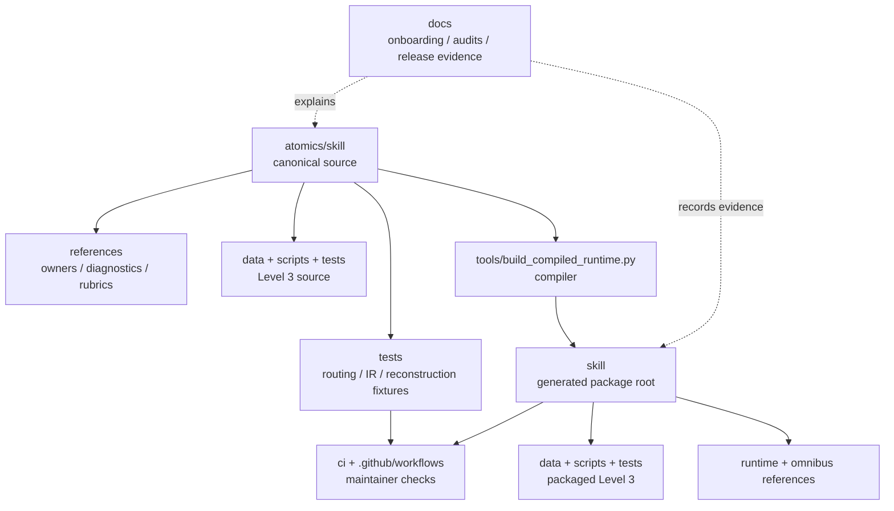
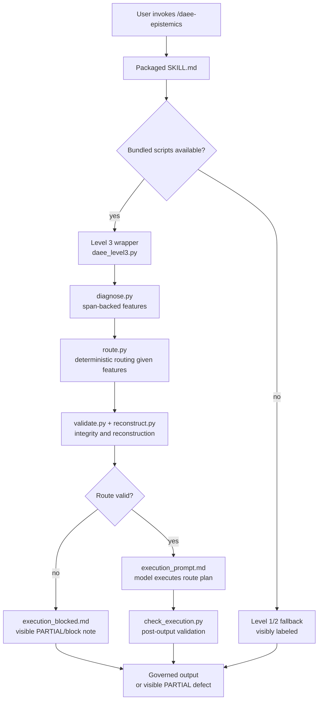

# daee-epistemics

`daee-epistemics` is a modular LLM skill and governed diagnostic framework for epistemic operations and noetic analysis: analogous to a cognitive-security framework for classifying discourse, diagnosing Orientation, Deformation, and Concealment, and routing engagements through matched Tactics, Techniques, Procedures, and Case Modules.

This repository now has two deliberate layers: canonical atomized source under [`atomics/skill/`](atomics/skill/) and a generated compiled Claude runtime under [`skill/`](skill/).

The package is grounded in the coherence and convergence of a common sense account of sound reason, the *fiṭrah* (the innate normative disposition toward truth), and revelation. 
It is designed to examine the condition of the *qalb* (heart-mind) and the *ʿaql* (intellect or reason) before replying to doubts, objections, and worldview conflicts. 
Its governing aim is not to manufacture novelty or simply accumulate clever refutations, but to restore sound cognition so that foundational knowledge, inference, testimony, signs, and revelation are encountered in their proper order.

Runtime coverage and scope in the packaged skill are represented by generated `skill/SKILL.md`, module front matter preserved from source, `compiled-module-map.json`, `module-catalogue.json`, routing indexes, and explicit owner/router scope notes. Future scope decisions live in [`TODO.md`](TODO.md).

## Table of Contents
- [Before You Use This Skill](#before-you-use-this-skill)
- [Terminology Note](#terminology-note)
- [Core Thesis](#core-thesis)
- [Why This Framing Fits the Repository](#why-this-framing-fits-the-repository)
- [What the Skill Protects](#what-the-skill-protects)
- [Threat Model](#threat-model)
- [Operational Governance](#operational-governance)
- [Render Modes](#render-modes)
- [Integration Boundary](#integration-boundary)
- [Source / Runtime Layout](#source--runtime-layout)
- [Repository Architecture](#repository-architecture)
- [Repository Diagram](#repository-diagram)
- [Install, Package, and Runtime Use](#install-package-and-runtime-use)

## Before You Use This Skill
The skill needs a practitioner whose own *fiṭrah* is in reasonable health.

Obstacles to clear:
- *bidʿī ʿaqlī* (contaminated rationality)
- *bidʿī naqlī* (corrupted transmission)

The diagnostic faculty is subject to the same taxonomy it applies. 

The skill identifies in interlocutors seven deformations of the *fiṭrah* — 
- *iʿtiqādāt mawrūtha* (inherited beliefs)
- *hawā* (whim, preconceived bias, or stubbornly clinging to personal opinion in the face of countervailing evidence)
- *ẓann* (conjecture)
- *taqlīd* (blind imitation)
- *ʿāda* (unreflective habit)
- *gharaḍ* (ulterior motive or vested interest)
- *shubhah* (doubt or misgivings)

A practitioner's diagnostic reads are only as reliable as the health of the practitioner's own noetic structure. 
A practitioner operating under *hawā* (will dug in), *gharaḍ* (something at stake), or *iʿtiqādāt mawrūtha* (invisible inherited filters) will produce reads contaminated by those deformations — and will execute every downstream tactic on the basis of those reads. The procedure does not fix a deformed faculty; it inherits its condition.

The skill is ordered toward restoration, not performance. 
The standpoint stated in §I — removal of occlusion, not construction of novelty; the task of reminder and restoration, not of winning — applies to the practitioner first. 
Using this skill as a debating instrument, a credential, or a means of forcing verbal concession is itself a deformation: *gharaḍ* or *hawā* operating in the practitioner rather than in the interlocutor.
The character note in §I is not decorative. 
"The absence of defensiveness, the quality of genuine listening" are epistemically constitutive — they are part of what makes the engagement reach where argument cannot, especially where doubt is entangled with damaged trust or bad religious experience.

The symmetric check applies inward before outward. 
`references/tactics/symmetric-taqlid-check.md` exists for a reason: an atheism absorbed from one's intellectual environment without genuine investigation is *taqlīd*, and so is a theism held by convention without genuine examination. Before deploying V7 against an interlocutor's assumed-by-default skepticism, the practitioner should have applied the same check to their own positions. The practitioner who holds their own commitments by *taqlīd* rather than *taḥqīq* has no standing to press the outward check. 
This is not a one-time gate — it is a standing discipline, because *iʿtiqādāt mawrūtha* can reestablish itself and *ʿāda* deepens with time.

The tool can assist getting there. 
The skill's diagnostic vocabulary — Deformation Types, Discourse Orientation, Noetic Structure across the nine analytical dimensions — is available for self-application. A practitioner who suspects their own reads are contaminated can run the noetic reading checklist and the seven deformations taxonomy on themselves, not only on interlocutors. 
Dimension 8 (discourse orientation) is especially apt: determine whether your own engagement is ordered toward truth and warrant, or toward identity-performance or vested outcome. This is a feature of the architecture, not an afterthought — the same instruments that produce a structured diagnostic of an interlocutor's noetic structure can produce one of the practitioner's own.

## Terminology Note

The repository uses Arabic and philosophical vocabulary because the framework itself is articulated in those terms. 
For fuller definitions, see [`references/terminology.md`](atomics/skill/references/terminology.md).

Readers unfamiliar with the vocabulary should treat these terms as named components of the framework. 
The repository's own method requires clarity before response, and that applies to terminology as well.

## Core Thesis

> `daee-epistemics` is best understood as analogous to an epistemic SOC: 
a structured system for identifying, classifying, and remediating epistemic distortion affecting the heart-mind.

The point of that analogy is architectural (onboarding-oriented), not ornamental. 

More fundamentally, the skill is attempting to formalise not only the handling of cases within the domain, but the domain’s own **epistemology, noetic analysis, diagnostic ontology, and meta-level grammar** by which cases are subjected to **first-order analysis, higher-order diagnosis, case-typing, routing, interpretation, and restoration**.

The skill covers a governed diagnostic and restorative framework for epistemological, ontological, metaphysical, theological, and related philosophical cases, while also formalising the meta-level grammar by which such cases are typed, routed, interpreted, and restored. 
It aims to externalise the domain’s diagnostic ontology into a compact DSL/IR so that both higher-order diagnosis and first-order analysis become explicit, auditable, and reusable. 
This means the encode/decode not just of answers, but the operative ontology of epistemic states, noetic structures and deformations, and restoration transitions: 
what kind of case is present, 
what level it is operating at, 
what is being smuggled or conflated, 
what must be clarified first, 
what routing follows, and 
how a case moves from deformation toward restored order.

In that sense, the framework is not just organising content; it is formalising a meta-epistemology and an operative map of noetic, epistemic, ontological, and meta-level states and transitions. That makes the system more disciplined at runtime, more portable across models, more compressible across context windows, and potentially usable not only as reference material but as a training grammar for diagnosis, analysis, and restoration. Governance determinacy is practitioner-compliance-based: enforcement depends on the practitioner following the governance files, not on a mechanical runtime validator. The `diagnostic-ir.schema.json` is a constraint specification; its compliance is checked conceptually against the schema's rules, not validated automatically at inference time.

This makes it desirable for both frontier and quantised LLMs, though for different reasons. 
For frontier models, it functions as external discipline: it reduces drift, forces explicit case-typing and routing, and makes outputs more auditable and reproducible rather than leaving the model to generate persuasive but structurally ungoverned prose. 
For quantised or smaller models, it functions as external cognitive compression: instead of having to internally reconstruct the whole domain at full resolution, the model can operate through a compact case language, typed state, and bounded restoration grammar.

In both cases, the point is the same: to shift the burden from vague latent improvisation toward a portable, inspectable, and reusable structure for diagnosis, analysis, and restoration.

The cognitive-security / epistemic-SOC analogy is helpful here as an onboarding frame, but it is secondary.

A Security Operations Center (SOC) does not begin by deploying countermeasures blindly; it initiates:
* intake
* triage
* classification
* root-cause analysis
* response selection. 

This repository applies a comparable logic to theological and philosophical engagement. 
It treats an objection not merely as a proposition to rebut, but as an event arising within a wider *noetic structure* (the underlying structure of how a person knows, trusts, reasons, and proportions belief).

Not a storehouse of arguments; this is a cognitive-security and diagnostic-response framework for epistemic compromise. 
Its aim is restorative: to clear occlusion, reorder cognition, and return the person to sound perception of truth rather than to construct belief from nothing.

## Why This Framing Fits the Repository

A SOC needs an inventory of systems and dependencies. In this skill, **Noetic Structure** functions like that inventory, as an asset map.

It maps:
* what the person takes as basic
* what they think counts as evidence
* whether their commitments are foundational or derivative
* how they proportion assent
* what they trust as testimony
* what inferential norms they presuppose
* what distortions are already upstream

So, noetic structure is not just "their worldview"; it is more like the **ontology of their epistemic operating environment.**

The repository begins with diagnosis before rebuttal. 
[`atomics/skill/SKILL.md`](atomics/skill/SKILL.md) instructs the practitioner to identify input type, epistemological position, mode of concealment, deformation, and discourse orientation before selecting any deeper module. 
That posture is the opposite of generic polemics, which often move straight to proposition-level refutation.

This matters because the framework treats falsehood as more than a bad conclusion. 
It also tracks compromised process: 
* inherited priors presented as neutral defaults
* malformed evidential standards
* grief operating as epistemic fog
* socially reinforced habits of discourse
* volitional resistance masquerading as pure rationality. 

A formally correct argument can fail if it is given to the wrong kind of case.

For that reason, the repository routes engagements by condition, not only by topic. 
In some cases the appropriate move is inferential; in others it is classificatory, clarificatory, or *maieutic* (a method of drawing out latent recognition rather than supplying wholly new content). 
The underlying assumption is that truth is often already signified but occluded, displaced, or misread.

Pattern-first routing is diagnostic precedence, not abstract universalism. It means the live
deformation, concealment, warrant disorder, or authority-order problem governs before superficial
denomination/topic labels. It does not make traditions interchangeable under neutral comparative
categories, and it does not claim arbitrary pattern-analysis generates truth. Restoration remains
ordered toward sound *fiṭrah*, sound reason, revelation, and their non-contradictory ordered
convergence.

Runtime routing is therefore:

```text
Pattern(deformation/concealment/unsoundness) > denomination/source-label
```

A named framework, school, source, author, genealogy, or identity may supply internal
source-status context, but it is not public-render material by default and is never sufficient to
route content or release an apologetic argument bank. Default citation is restricted to Qurʾān,
Sunnah, and sound Salaf narrations with direct source reference. The DSL/IR routes by the detected
noetic operation: criterion import, tribunal installation, predication error, authority-order
disorder, warrant failure, concealment, deformation, and the active `claim_level` /
`pattern_profile`.

## What the Skill Protects

The protected asset is not "belief" in a thin or merely verbal sense. 
The framework is concerned with the integrity of epistemic constitution as rightly ordered toward truth: 
* the *fiṭrah*
* sound *ʿaql*
* the right relationship among foundational knowledge
* inferential knowledge
* testimony
* signs
* revelation.

That is why the repository is restorative rather than novelty-producing. 
It assumes that sound reason and authentic revelation agree, and that many objections become persuasive only after the noetic environment has already been disordered. 
The work, then, is to identify that disorder and respond at the right depth.

## Threat Model

The framework's threat model includes more than explicit disbelief. It also includes conditions that deform inquiry upstream:

- inherited background assumptions posing as neutrality
- *taqlīd* (unexamined imitation) and socially inherited defaults
- malformed evidential standards that treat one narrow criterion as the whole of rationality
- category mistakes, equivocation, univocal predication failures, domain-boundary violations, and false contrasts
- grief, injury, or moral protest functioning as epistemic fog
- identity-protective habits of discourse
- volitional resistance and vested interest
- pseudo-rational criteria that parasitize genuine rational norms

In this model, an objection may be intellectually formulated while still arising from a compromised epistemic process. 
That is why the repository repeatedly distinguishes deformations, concealment modes, and discourse orientation before recommending a response.

## Operational Governance

The repository is not only a content store. It carries an explicit governance layer that makes its routing state inspectable:

- a compact case-state schema for naming what kind of case is being read, which module subset is being selected, why, with what confidence
- a conditional `claim_level` / `pattern_profile` layer in case-state and diagnostic IR for distinguishing first-order objections from meta-epistemic, meta-ontological, and meta-noetic burdens when that distinction changes routing
- an inference-boundary legend separating direct file content from cross-file synthesis, model inference, and speculative extension
- mixed-case and insufficient-basis rules to keep the model from overclassifying thin or ambiguous cases
- an anti-pattern sheet to catch diagnosis collapse, forced fit, tactic over-selection, decorative terminology, higher-order vocabulary theater, rhetorical overreach, excerpt over-read, and register-hold bypass before they harden into output

**Burden-cycle model (orientation for first-contact readers):** The skill is not a one-shot
pipeline. It reduces a live burden into internal Diagnostic IR, routes only after the
dispatch gate, renders the permitted surface, then re-reads state before STOP, HOLD,
RECURSE, or PARTIAL. Runtime detail is owned by
[`diagnostic-ir.md`](atomics/skill/references/diagnostics/diagnostic-ir.md),
[`recursive-state-transitions.md`](atomics/skill/references/diagnostics/recursive-state-transitions.md),
[`routing-precedence.md`](atomics/skill/references/diagnostics/routing-precedence.md),
[`diagnostic-render-contract.md`](atomics/skill/references/rubrics/diagnostic-render-contract.md),
and [`output-release.md`](atomics/skill/references/rubrics/output-release.md).

This matters because the repository's thesis is restorative, not merely polemical. 
The framework should make it easy for a model to say, succinctly, "this is the kind of case I think this is, this is why I am taking this path, this is how sure I am, and this is where I am inferring beyond the file set."

## Render Modes

Canonical invocation forms:

```text
/daee-epistemics
/daee-epistemics:dsl
```

- `/daee-epistemics` is the default diagnostic compiler mode:
  `Layer A(compact DSL/IR header) + Layer B(bounded governed response) + State/noetic re-read`.
  Layer B visibly includes Hidden Premises, local Core Formulation per released operation,
  bounded operative submoves, and compact TTP/operator trace when a named operator performs
  work. State/noetic re-read comes before the single Restorative Response and final Closing Formulation.
  It does not print raw Diagnostic IR, full Case State, `matched_modules`, route ledger,
  or load ledger.
- `/daee-epistemics:dsl` is concise DSL / IR printout mode: compact Diagnostic IR or Case State, live noetic burden sequence, held material, state re-read, and STOP / HOLD / RECURSE / PARTIAL when visible structure is requested.

Default output must visibly instantiate compact compiler state enough to prevent clean essay
cosplay. The exact field list and failure modes are owned by
[`diagnostic-render-contract.md`](atomics/skill/references/rubrics/diagnostic-render-contract.md)
and the root control plane in [`atomics/skill/SKILL.md`](atomics/skill/SKILL.md).
Recursive render details are governed by the runtime references, not by the
README; compact output is a concise governed surface, not a thin mode.

`/daee-epistemics:audit` is deprecated as a public render mode and retained only as an internal/development compatibility surface for regression review, bundle/source-basis inspection, and procedural debugging. Default mode must not depend on `:audit` for governance visibility.

The former external recursive-audit prompt is deprecated for normal use. Its useful traversal discipline is now internal governance; use `:dsl` for compact visible diagnostic structure.

## Integration Boundary

New background material should be integrated only when it improves routing, restoration, scope control, or terminology discipline.

The goal is not to accumulate study notes. 

The goal is to extract durable distinctions and convert them into reusable architecture: new Case Modules, tighter Tactic or Technique criteria, clarified Glossary entries, sharper confidence rules, or better routing boundaries. 

If material does not alter how the skill classifies, sequences, or restores, it should usually stay outside the live skill surface.

## Source / Runtime Layout

The editable source and deployable runtime are intentionally separate:

| Path | Role |
|------|------|
| [`atomics/skill/`](atomics/skill/) | Canonical atomized skill source. Edit this tree. |
| [`skill/`](skill/) | Generated compiled Claude package root. Do not hand-edit this tree. |
| [`tools/`](tools/) | Compiler and checker scripts. |
| [`tests/routing-fixtures/`](tests/routing-fixtures/) | Static routing parity fixtures. |
| [`docs/`](docs/) | Architecture notes, audits, and verification reports. |
| [`build/`](build/) | Optional local package/release outputs. |

Normal source workflow:

```bash
python tools/build_framework_pipeline.py
python tools/build_compiled_runtime.py
python tools/check_compiled_runtime_freshness.py
python tools/check_level3_data_shapes.py --include-generated
python tools/check_package_shape.py
python tools/check_compiled_module_boundaries.py
python tools/check_stub_integrity.py
python tools/check_consolidation_call_budget.py
python tools/check_routing_parity.py
python tools/check_routing_parity.py --strict
python tools/check_recursive_traversal_governance.py
python tools/check_render_modes.py
python tools/check_frontmatter.py
python tools/check_coverage.py
python tools/check_framework_pipeline.py
python tools/check_recursion_collapse_noetic_frame.py
python tools/check_metacompliance_current_canon.py
python tools/check_smoke_artifacts.py
python tools/check_ir_instance_integrity.py
python tools/check_diagnostic_ir_catalogue_integrity.py
python tools/check_encoding_hygiene.py
```

The compiled runtime may still name atomized paths such as `references/tactics/M9-predication-mode.md`.
Inside `skill/`, those are canonical source identities unless the file actually exists there.
Resolve missing atomized paths through `skill/compiled-module-map.json` to the containing runtime
bundle and `MODULE_ID` section.

## Repository Architecture

The repo is organized around one source-of-truth tree, one generated runtime
tree, and several verification surfaces. Edit canonical source under
`atomics/skill/`, then regenerate `skill/`; do not hand-edit generated runtime
files as the source of truth.

| Path | Role |
|------|------|
| [`atomics/skill/`](atomics/skill/) | Canonical editable skill source: root instructions, references, Level 3 data/scripts/tests, and owner files. |
| [`atomics/skill/references/`](atomics/skill/references/) | Canonical noetic, diagnostic, TTP/owner, procedure, rubric, and case-library source. |
| [`atomics/skill/data/`](atomics/skill/data/) | Level 3 executable routing data: trigger matrix, precedence, module catalogue, and ontology licenses. |
| [`atomics/skill/scripts/`](atomics/skill/scripts/) | Level 3 source scripts for diagnosis, deterministic routing-given-features, validation, reconstruction, orchestration, and execution checking. |
| [`atomics/skill/tests/`](atomics/skill/tests/) | Package-local Level 3 fixtures and expected route plans. |
| [`skill/`](skill/) | Generated package/runtime root. Build from atomics; upload/package this tree's contents. |
| [`skill/data/`](skill/data/) and [`skill/scripts/`](skill/scripts/) | Generated Level 3 runtime data and scripts bundled with the skill package. |
| [`skill/references/`](skill/references/) | Generated runtime and omnibus bundles. Availability is not activation. |
| [`skill/compiled-module-map.json`](skill/compiled-module-map.json) | Runtime resolver from original module ID/source path to generated bundle section. |
| [`skill/build-manifest.json`](skill/build-manifest.json) | Generated freshness and source-checksum manifest. |
| [`tools/`](tools/) | Build, checker, smoke-artifact, IR, routing, reconstruction, and hygiene tooling. |
| [`tests/`](tests/) | Static routing, IR, and reconstruction fixtures for maintainers. |
| [`ci/`](ci/) and [`.github/workflows/`](.github/workflows/) | Maintainer CI wrappers around local checks. |
| [`docs/`](docs/) | Architecture notes, onboarding, release logs, and audit evidence; not runtime source. |

Read behaviorally, the architecture works like this: diagnose the noetic state,
identify the live burden and restoration target, classify deformation,
concealment, and discourse orientation, route only through licensed owners, land
the current burden, re-read state, then stop, hold, recurse, or mark partial.
In Level 3-capable runtimes, the route plan makes that sequence executable and
checkable; in scriptless runtimes, the same governance remains instructional.

[`atomics/skill/references/techniques/heuristics.md`](atomics/skill/references/techniques/heuristics.md) functions as the analyst-discipline layer governing how the framework is used.

## Repository Diagram

The diagrams below split the repo into three views: source layout, runtime
invocation, and maintainer verification. The full internal pipeline audit
surface remains [`framework-pipeline.md`](atomics/skill/references/diagnostics/framework-pipeline.md);
abstract recursive state-transition semantics live in
[`recursive-state-transitions.md`](atomics/skill/references/diagnostics/recursive-state-transitions.md).

### Repository Layout


```mermaid
flowchart TB

SRC["atomics/skill<br/>canonical source"]
SRCREF["references<br/>owners / diagnostics / rubrics"]
SRCL3["data + scripts + tests<br/>Level 3 source"]
BUILD["tools/build_compiled_runtime.py<br/>compiler"]
RUNTIME["skill<br/>generated package root"]
RTREF["runtime + omnibus references"]
RTL3["data + scripts + tests<br/>packaged Level 3"]
TESTS["tests<br/>routing / IR / reconstruction fixtures"]
CI["ci + .github/workflows<br/>maintainer checks"]
DOCS["docs<br/>onboarding / audits / release evidence"]

SRC --> SRCREF
SRC --> SRCL3
SRC --> BUILD
BUILD --> RUNTIME
RUNTIME --> RTREF
RUNTIME --> RTL3
SRC --> TESTS
TESTS --> CI
RUNTIME --> CI
DOCS -. explains .-> SRC
DOCS -. records evidence .-> RUNTIME
```

### Runtime Invocation


```mermaid
flowchart TB

USER["User invokes /daee-epistemics"]
SKILL["Packaged SKILL.md"]
SCRIPTQ{"Bundled scripts available?"}
L3["Level 3 wrapper<br/>daee_level3.py"]
DIAG["diagnose.py<br/>span-backed features"]
ROUTE["route.py<br/>deterministic routing given features"]
VALIDATE["validate.py + reconstruct.py<br/>integrity and reconstruction"]
PROMPTQ{"Route valid?"}
BLOCK["execution_blocked.md<br/>visible PARTIAL/block note"]
EXEC["execution_prompt.md<br/>model executes route plan"]
CHECK["check_execution.py<br/>post-output validation"]
OUTPUT["Governed output<br/>or visible PARTIAL defect"]
FALLBACK["Level 1/2 fallback<br/>visibly labeled"]

USER --> SKILL
SKILL --> SCRIPTQ
SCRIPTQ -->|yes| L3
SCRIPTQ -->|no| FALLBACK
L3 --> DIAG --> ROUTE --> VALIDATE --> PROMPTQ
PROMPTQ -->|no| BLOCK --> OUTPUT
PROMPTQ -->|yes| EXEC --> CHECK --> OUTPUT
FALLBACK --> OUTPUT
```

### Maintainer Verification


```mermaid
flowchart LR

EDIT["Edit atomics/skill"]
BUILDPIPE["build_framework_pipeline<br/>build_compiled_runtime"]
FRESH["freshness + module boundaries<br/>stub integrity"]
ROUTING["routing parity<br/>reconstruction fixtures"]
GOV["render / recursion / metacompliance<br/>IR integrity"]
L3FIX["Level 3 fixture runner<br/>stability repetitions"]
SMOKE["smoke artifact checks<br/>release evidence boundary"]
PACKAGE["optional package build<br/>hash + current-release smokes"]

EDIT --> BUILDPIPE --> FRESH --> ROUTING --> GOV --> L3FIX --> SMOKE --> PACKAGE
```

## Install, Package, and Runtime Use

### Package Boundary

The canonical user-facing upload name is `daee-epistemics.skill`. For the v0.3.2.0 release line,
the package artifact is built from the generated `skill/` root and recorded in
[`docs/release-artifacts.md`](docs/release-artifacts.md). GitHub Releases are the binary
distribution surface; older v0.3.1.0 assets and smokes are historical evidence, not
current-package evidence for v0.3.2.0.
`package.ps1` emits a local `.skill.zip` archive because it is a zip payload with the skill root
at archive root. Publish/upload the same checked payload as `.skill`; do not publish both `.skill.zip`
and `.skill`, and do not re-zip it.

Binary skill archives are not committed to this repository. Build locally with `package.ps1` from
the generated `skill/` root, or use the verified public GitHub Release asset.

The archive root must contain `SKILL.md`, `references/`, `data/`, `scripts/`, `tests/`,
`compiled-module-map.json`, `build-manifest.json`, and `README.md` directly. Do not zip the
whole repo root, and do not produce a bundle whose top level is `skill/`. Package the contents
of the generated `skill/` directory, not the directory itself.

For path fidelity, build the archive with the manifest-backed package script. It validates the
generated `skill/` tree, rejects unexpected packageable files, and writes slash-safe archive entry
names for skill hosts that inspect the bundle structure directly.

On Windows, `package.ps1` calls the Python packager in `tools/package_skill.py`. For a v0.3.2.0
local package rebake, the command is:

```powershell
powershell -NoProfile -ExecutionPolicy Bypass -File .\package.ps1 build\daee-epistemics-v0.3.2.0.skill.zip
Copy-Item build\daee-epistemics-v0.3.2.0.skill.zip build\daee-epistemics-v0.3.2.0.skill
```

From any folder, open a Bash-compatible terminal and paste the following if you want a clone-and-package flow. The command clones the repo into a temporary subfolder, builds `daee-epistemics.skill` from the generated `skill/` contents, and removes the temporary clone so the folder you opened ends with only `daee-epistemics.skill`.

```bash
repo="https://github.com/theislampill/daee-epistemics.git"
tmp="daee-epistemics-src"
tmp_zip="daee-epistemics.tmp.skill.zip"
out_skill="daee-epistemics.skill"

rm -rf "$tmp" "$tmp_zip" "$out_skill"
git clone "$repo" "$tmp" &&
(cd "$tmp" &&
  python tools/build_framework_pipeline.py &&
  python tools/build_compiled_runtime.py &&
  python tools/check_compiled_runtime_freshness.py &&
  python tools/check_level3_data_shapes.py --include-generated &&
  python tools/check_package_shape.py &&
  python tools/package_skill.py "../$tmp_zip") &&
mv -f "$tmp_zip" "$out_skill" &&
rm -rf "$tmp"
```

If you open `daee-epistemics.skill`, you should see `SKILL.md`, `references/`, `data/`,
`scripts/`, `tests/`, `compiled-module-map.json`, `build-manifest.json`, and `README.md` at
the top level of the archive.

### Claude Installation

1. Package the skill from this repository.
2. Open Claude.ai and go to Settings > Skills, or open [Claude Skills](https://claude.ai/customize/skills).
3. Upload `daee-epistemics.skill`.
4. Enable the skill and test it with a query that should trigger epistemic diagnosis or objection handling.

### Codex Invocation

The same `.skill` bundle may also work in Codex and other skill-capable agent
platforms. In Codex, ordinary use should stay simple:

```text
/daee-epistemics [input]
```

Level 3 is the default path for `/daee-epistemics [input]` in Codex/script-capable
runtimes when bundled scripts are available. Runtimes that cannot execute
bundled scripts must visibly fall back to Level 1/2 behavior. Light cases spend
a few extra seconds in the wrapper; hard cases get the same binding route
discipline.

### Codex Level 3 Runtime Path

Level 3 makes routing executable rather than merely interpretive:

```text
python scripts/daee_level3.py --input <input.md> --out <run-dir>
```

It produces `features.json`, `route_plan.json`, reconstruction/validation
verdicts, and, when the route is valid, `execution_prompt.md`. If route
generation writes `execution_blocked.md`, return that visible PARTIAL/block
note and do not execute an ordinary answer. After the model answers from a
valid execution prompt, validate the answer against the route plan:

```text
python scripts/check_execution.py --route <run-dir>/route_plan.json --output <run-dir>/output.md
```

If execution validation returns `partial` or `fail`, the user-facing response
should include:

```text
PARTIAL - Level 3 execution check: <specific defect>
```

Honest release claim: daee-epistemics ships with deterministic routing
(`route.py`) over span-backed feature extraction (`diagnose.py`), with route
plans validated by reconstruction (`reconstruct.py`) and post-output execution
checked (`check_execution.py`). Routing is deterministic given features.
Feature extraction has interpretive components with input-span validation.
Transformer execution remains probabilistic; highest-complexity burdens remain
bounded by model capability even under Level 3 routing. Pure-Hermes parity,
fixture-18 resolution, catalogue-wide executable Level 3 coverage, codons, and
owner packs are not claimed.

### Scriptless Runtime Fallback

Runtimes that cannot execute bundled scripts must visibly fall back to Level 1/2
behavior and label that fallback:

```text
Level 1/2 invocation - Level 3 wrapper unavailable in this runtime
```

Scriptless fallback preserves the instructional governance in `SKILL.md`, but
it does not claim Level 3 route-plan validation or post-output execution
checking.

### Maintainer Commands

Before release, regenerate and verify the runtime with the command set in
[Source / Runtime Layout](#source--runtime-layout). Maintainers can run the
required contrast/stability fixtures plus the hard regression fixture locally
with:

```text
python skill/scripts/daee_level3.py --run-fixtures --simulate-output --repeat-stability 5
```

For package-root debugging, the equivalent in-package command shape is:

```text
python scripts/daee_level3.py --run-fixtures --simulate-output --repeat-stability 5
```

Any `--simulate-output` run is simulated structural route/check verification only. It must not
be reported as behavioral smoke, real model execution, or Level 1/2 shrinkage-regression
recovery.

### Release Smoke Boundary

Smoke tests should use the current package filename and SHA recorded in
[`docs/release-artifacts.md`](docs/release-artifacts.md).
Do not use `build/compiled-skill/` or older local archives as smoke-test inputs. The release smoke
artifact suite is committed under `smokes/runtime-grounding-v5/` as regression evidence; future
live runs may regenerate it, but the checker defaults to that repo-local root.
`tools/check_smoke_artifacts.py` also compares smoke package provenance against
`docs/release-artifacts.md` and rejects unmarked package-hash drift.
When a current-release smoke suite is truthfully regenerated, run
`python tools/check_smoke_artifacts.py --require-current-release-smokes` as a release-promotion
check. In this source state, the committed `runtime-grounding-v5` suite is historical regression
evidence, so the strict flag is expected to fail until current-release smokes exist.
Current readiness checks and smoke prompts live in [`docs/package-smoke-readiness.md`](docs/package-smoke-readiness.md).
