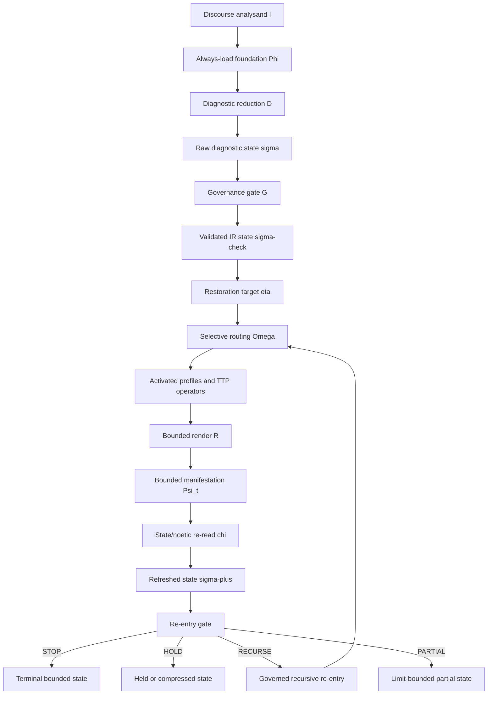

# Framework Pipeline Formalization

Explanatory / audit formalization only.
Not live routing authority.
Does not create routes, module activation rules, IR fields, or source owners.
Does not alter `framework-pipeline.md`, the generated ASCII pipeline, or the runtime dispatch gate.

This document preserves the formal and visual material formerly colocated with
`atomics/skill/references/diagnostics/framework-pipeline.md`. The operative runtime sources now
split authority as follows:

- `framework-pipeline.md` owns the compiled pipeline audit surface and forbidden shortcuts.
- `recursive-state-transitions.md` owns abstract STOP / HOLD / RECURSE / PARTIAL semantics.
- `diagnostic-ir.md`, `routing-precedence.md`, `output-release.md`,
  `diagnostic-render-contract.md`, and `P7-restoration-stops.md` own their respective concrete
  governance domains.

This document is the correct home for richer formal-operator language because it lets maintainers
preserve the conceptual architecture without making the live pipeline look like a second routing
grammar. If this document and an operative source disagree, the operative source wins.

## Authority Boundaries

This formalization is safe to use for:

- maintainer orientation;
- audit explanation;
- smoke-test design;
- vocabulary alignment across docs;
- reasoning about why the generated pipeline has its current shape.

It is not safe to use for:

- selecting a route;
- adding a route ID, PF code, IR field, or module owner;
- bypassing Diagnostic IR formation;
- replacing `routing-precedence.md`;
- changing default output shape;
- treating a route itinerary as the current bounded operator.

## Noetic Structure and Meta-Noetic Memetics

Noetic structure is the object of diagnosis. It is not merely a list of claims, a worldview
label, or a topic bucket. It is the operative configuration by which a subject is carrying the
case: commitments, grounding relations, inferential norms, testimonial posture, interpretive
filters, stabilization structure, and routing-relevant dependencies.

Those grounding relations may be read graph-like, and locally may be read in DAG-like form, but
the live control surface is richer than a pure graph. It must also carry weighting, suppression,
underdetermination, concealment, release conditions, and the practical question of what downstream
dependencies will fail if a load-bearing premise, criterion, or authority node is cleared.

Meta-noetic memetics names the dynamic behavior of semantic-intellectual units within and around
that structure. It does not replace existing distinctions around concealment, criterion-smuggling,
semantic capture, tribunal importation, or defensive stabilization. It clarifies how those
already-named dynamics dock, persist, mutate, propagate, and instantiate in language, communities,
and self-presentations of rationality or neutrality.

The Diagnostic IR is where those readings become governable. This document names the conceptual
architecture; `diagnostic-ir.md` makes it actionable through repo-owned fields, gates, and failure
tests. The vocabulary here creates no new pass and no new IR field.

## Interpretive Note

The framework does not treat discourse as a blob to ingest and answer in one pass. It treats
discourse as an external analysand that can be inspected, decomposed, routed, manifested in
bounded form, refreshed, and re-entered under governance.

That clarification does not rename the repo into another vocabulary. It makes explicit what
route-first discipline, Diagnostic IR governance, output-release constraints, and refreshed-state
continuation already require.

The operative success condition is restorative structural viability: a noetic configuration whose
grounding, routing, release, and recursive continuation remain ordered toward restoration rather
than tribunal capture, semantic trap, memetic persistence, brittle pseudo-stability, or mere
contradiction-production.

## Runtime-Verifiable Diagnostic Compiler

The live pipeline should be read as a diagnostic compiler, not as an argument bank. An input case
does not select a stored rebuttal. It reduces into validated IR, activates only owner-backed TTP
operators justified by that IR, and converges through controlled state transitions.

The compiler invariant is:

```text
input case
-> diagnostic reduction
-> validated IR
-> one live noetic burden
-> operative submoves
-> burden result
-> state/noetic re-read
-> STOP / HOLD / RECURSE / PARTIAL
```

This docs-level formalization mirrors the runtime owners:

- `diagnostic-ir.md` owns the validated compiler state.
- `routing-precedence.md` owns owner-backed selection and TTP entry before activation.
- `recursive-state-transitions.md` owns TTP entry/exit criteria, depth guards, and convergence.
- `output-release.md` and `diagnostic-render-contract.md` own Layer A / Layer B release checks.
- `framework-pipeline.md` owns diagram parity and forbidden-shortcut indexing.

The diagram must therefore show IR before routing, one selected live noetic burden, operative
submoves, burden result, state/noetic re-read, and controlled STOP/HOLD/RECURSE/PARTIAL convergence. If a diagram
or smoke report collapses those stages into linear argument delivery, it is no longer describing
the live runtime.

## Mermaid Audit Graph



## Formal Operator View

The ASCII chart in `framework-pipeline.md` remains the live audit surface. The formal view below
makes the same governed interpretive framework explicit in operator form. It does not replace
repo-native routing language, and it does not reduce the ontology to a pure graph. It identifies
where discourse is formalized, validated, selectively activated, manifested under bounded
permissions, refreshed, and re-entered under governance.

At the highest level, the framework is not a one-shot router. It is a governed
selective-recursive diagnostic architecture whose continuation is rejudged after every bounded
move.

Let the always-load foundation be:

```math
\Phi = \{\alpha,\beta\}
```

where `\alpha` names the kernel commitments and `\beta` names the always-load substrate.

For each governed pass `t`, the framework can be stated as:

```math
\sigma_t = D(I_t, \Phi; \delta)
```

```math
\sigma_t^{\checkmark} = G(\sigma_t \mid \gamma)
```

```math
\eta_t = \operatorname{Target}(\sigma_t^{\checkmark})
```

```math
(\rho_t,\mu_t) = \Omega(\sigma_t^{\checkmark}, \eta_t)
```

```math
\Psi_t = \mathcal{R}(\rho_t,\mu_t,\sigma_t^{\checkmark},\eta_t)
= \langle \lambda_{A,t}, \lambda_{B,t}, \tau_t \rangle
```

```math
\sigma_{t+1} = \chi(\sigma_t^{\checkmark}, \Psi_t, \eta_t)
```

```math
\kappa(\sigma_{t+1}, \eta_t) \in \{\texttt{STOP}, \texttt{HOLD}, \texttt{RECURSE}, \texttt{PARTIAL}\}
```

This is the quantized general framework in repo-native form: diagnostic reduction, governance,
restoration targeting, selective routing, bounded manifestation, state/noetic re-read, and governed
re-entry. As formalization, it is explanatory only. It does not replace repo-native routing
language, and it does not license any shortcut around the generated pipeline order.

## Symbol Legend

| Symbol | Repo-native meaning |
|---|---|
| `I_t` | current discourse analysand for the pass |
| `Phi` | always-load foundation carried into the pass |
| `alpha` | kernel commitments / governing anchors |
| `beta` | always-load substrate: terminology, indices, heuristics, and standing background |
| `D` | diagnostic reduction through V1 and the mandatory passes |
| `delta` | ordered pass family extracting the live state |
| `sigma_t` | raw diagnostic state before validation |
| `G` | governance / validation gate |
| `gamma` | routing precedence, stops, semantic discipline, register constraints, and related hard rails |
| `sigma_t-check` | validated actionable IR state |
| `eta_t` | live restoration target named from the validated state |
| `Omega` | selective routing / owner activation |
| `rho_t` | activated routed profile set |
| `mu_t` | activated TTP operator set |
| `R` | bounded render under current permissions |
| `Psi_t` | bounded manifestation for the pass |
| `lambda_A` | Layer A retained diagnosis |
| `lambda_B` | Layer B deployable move |
| `tau_t` | restoration trace for the pass |
| `chi` | refreshed-state update after bounded manifestation |
| `kappa` | recursive governance output: stop, hold, recurse, or partial |

## Global Operator

The total system can be summarized as:

```math
\hat{\mathcal{S}}_{\eta,\kappa}
=
\mathrm{Iterate}_{\kappa,\eta}
\Big[
\chi
\circ
\mathcal{R}
\circ
\Omega
\circ
G
\circ
D
\Big]
```

Applied to raw discourse `I` under the always-load foundation `Phi`:

```math
\Psi^{*}
=
\hat{\mathcal{S}}_{\eta,\kappa}(I,\Phi)
```

The composition reads right-to-left: diagnosis, governance, selective routing, render, refresh,
then continuation judgment.

The operator notation is intentionally downstream of the repository's concrete owners. `D` does
not replace V1 or Phase 2; `G` does not replace the Diagnostic IR gate; `Omega` does not replace
routing precedence; `R` does not replace output-release or render-contract governance; `chi` and
`kappa` do not replace state/noetic re-read or recursive-state transitions.

## Functional Pipeline

1. Initialization binds raw discourse to governing anchors and always-load substrate.
2. Diagnostic reduction forms a structured diagnostic state.
3. Gated validation checks routing precedence, stops, semantic discipline, register constraints,
   and related hard rails.
4. Selective routing activates only profiles and operator surfaces justified by current validated
   state and restoration target.
5. Bounded manifestation renders retained diagnosis, deployable engagement, and restoration trace
   under current permissions.
6. Post-render re-entry refreshes state and selects STOP, HOLD, RECURSE, or PARTIAL under the
   operative rules in `recursive-state-transitions.md`.

## Interpretive Conclusion

This formalization treats the framework as a governed selective-recursive architecture:

- Diagnostic IR is the actionable audited control surface.
- Routing is selective activation from validated state.
- Output is bounded manifestation, not unconstrained discharge.
- Recursion is permitted only through refreshed state.
- TTPs are selective recursive operators rather than ambient expansion rules.
- The end is restorative structural viability, not contradiction-production.
