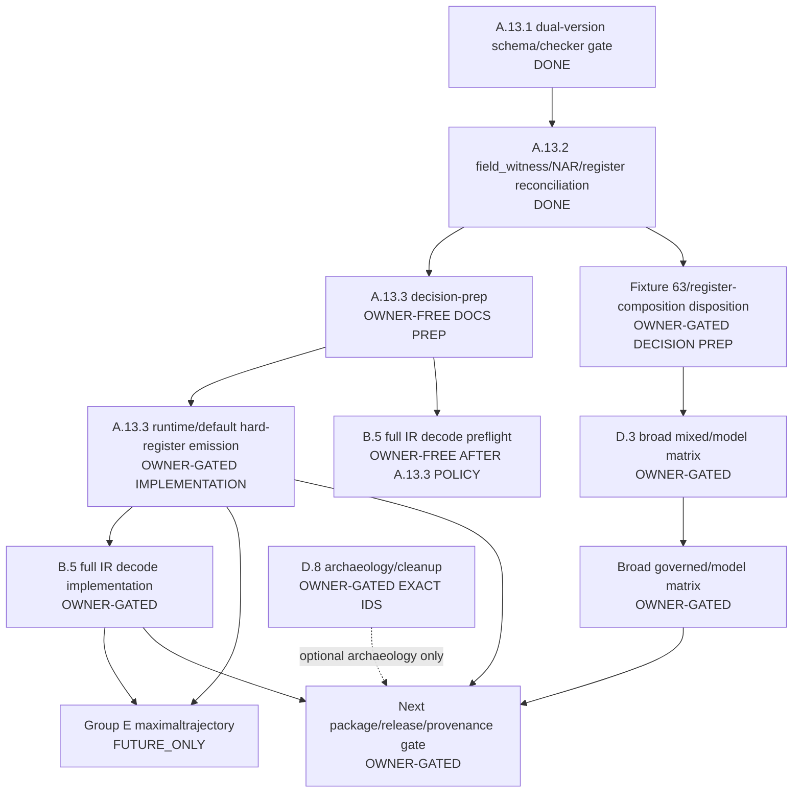

# Post-A.13.2 Architecture Roadmap

Prepared under IMPLEMENTAUDIT on 2026-06-01.

This roadmap converts the remaining post-A.13.2 ledger loose ends into an
execution/decision graph. It is a docs/audit source-boundary artifact only. It
does not implement A.13.3, full IR decode, fixture 62, D.8 archaeology, model
smokes, package, tag, upload, GitHub release work, or provenance.

## Current Verified State

Gemba baseline for this roadmap:

- Branch/worktree at start: `main` tracking `origin/main`.
- HEAD at start: `b2c13d76ab7991440e35d9597626dd043d7f3f7a`
  (`v0.4.3.x: split closed fixture 62 queue entry`).
- `origin/main` at start:
  `b2c13d76ab7991440e35d9597626dd043d7f3f7a`.
- GitHub CI for HEAD: run `26730205850` PASS.
- GitHub Pages for HEAD: run `26730205395` PASS.
- v0.4.3.5 package/provenance release is complete and recorded in
  `docs/release-artifacts.md`, `docs/v0.4.3.5-release-notes.md`, and
  `docs/v0.4.3.5-release-log.md`.
- A.13.1 is implemented.
- A.13.2 is implemented and live-CI verified as a checker/fixture-first
  hard-register field-witness/NAR/register-composition reconciliation slice.
- A.13 remains partial: runtime/default hard-register emission and full IR
  decode are not opened.
- D.8 safe subset is complete/already closed at spawn-edge level. The remaining
  459 rows are preserved backlog / future archaeology.
- B.1/B.2/B.4/B.5 retained-sidecar and retained-corpus accounting have been
  hardened through strict sidecar gates, semantic sidecar hash checks,
  promotion-helper gates, and canonical coverage-target exactness.
- D.3 schema-light no-model checker/fixture slices have advanced through AS-8,
  MM-2, MM-5, MM-7, MM-8, and fixture 62.
- Session orchestration policy exists in
  `docs/audits/SESSION_ORCHESTRATION.md`.
- ActiveGraph is available only as ignored, noncanonical sidecar metadata.
- Graphify is navigation only.

## Closed / Schema-Light Closed Rows

| Row | Status | Evidence Summary |
|---|---|---|
| A.1 | `CLOSED_VERIFIED_SCHEMA_LIGHT` | Formal termination proof slice recorded in the formalism docs and target-row status. |
| A.3 | `CLOSED_VERIFIED_SCHEMA_LIGHT` | MRP exhaustion lemma recorded; B.1 consumes it as proof basis. |
| A.7 | `CLOSED_VERIFIED` | Closed LoopBreak licensing vocabulary and checker/fixture canaries recorded. |
| A.8 | `CLOSED_VERIFIED` | Deterministic owner ordering/tiebreaker slice recorded. |
| A.10 | `CLOSED_VERIFIED_SCHEMA_LIGHT` | NLA isomorphism definition and schema-light checker evidence recorded. |
| A.12 | `CLOSED_VERIFIED_SCHEMA_LIGHT` | Reproducibility harness and same-SHA/schema-light evidence recorded. |
| B.3 | `CLOSED_VERIFIED_SCHEMA_LIGHT` | Certificate-backed Output Grapher support is warning-clean for retained sidecars. |
| D.1 | `CLOSED_VERIFIED` | Governed hard-smoke corpus and manifest gate recorded. |
| D.4 | `CLOSED_VERIFIED` | No-patch audit found no stale retained valid/golden fixture schema. |
| D.5 | `CLOSED_VERIFIED` | CI/package/proof-corpus gates and action-version maintenance recorded. |
| D.6 | `CLOSED_VERIFIED` | Graphify policy is read-only navigation aid only. |
| D.7 | `CLOSED_VERIFIED` | ActiveGraph policy is ignored local sidecar only. |

## Partial Rows With Named Residuals

| Row | Status | Residual |
|---|---|---|
| A.13 | `PARTIAL_RESIDUAL_NAMED` | A.13.1 and A.13.2 are done. Runtime/default hard-register emission, full IR decode integration, hard-register governed-output proof, package/provenance renewal, and later slices remain unclaimed. |
| B.1 | `PARTIAL_RESIDUAL_NAMED` | Schema-light retained graph-completeness/certificate corpus is strong, but broad harness/default adoption and broader governed/paraphrase/cross-host proof are not claimed. |
| B.2 | `PARTIAL_RESIDUAL_NAMED` | Checker-owned collapse certificate sidecars and schema validation are covered; broad runtime/default sidecar/certificate emission remains unclaimed. |
| B.4 | `PARTIAL_RESIDUAL_NAMED` | Raw-input fingerprint sidecars are retained and checked; broad retained-smoke sidecar adoption remains partial. |
| B.5 | `PARTIAL_RESIDUAL_NAMED` | Bounded schema-light ACT/body semantic reconstruction works; full IR-state decode remains blocked by later A.13/full-IR decisions. |
| C.5 | `PARTIAL_RESIDUAL_NAMED` | Named restoration-recoil subtype set is focused-proof covered; broad case-family matrix remains partial. |
| C.6 | `PARTIAL_RESIDUAL_NAMED` | Two-track primary/restoration proofs are focused-proof covered; broad case-family matrix remains partial. |
| C.7 | `PARTIAL_RESIDUAL_NAMED` | Divergence/curl and one current LoopBreak path are focused-proof covered; broad case-family matrix remains partial. |
| D.2 | `PARTIAL_RESIDUAL_NAMED` | Closing Formulation checker/fixture and retained proof cases are covered; all-output adoption remains partial. |
| D.3 | `PARTIAL_RESIDUAL_NAMED` | AS-8/MM-2/MM-5/MM-7/MM-8/fixture-62 no-model slices and retained mixed cases are covered; broad mixed variant/model-governed matrix remains partial. |

## Owner-Gated Rows

| Row / Area | Status | Gate |
|---|---|---|
| A.13.3 runtime/default hard-register emission | `OWNER_GATED` | Requires explicit owner approval before any implementation. |
| Full IR decode / B.5 hard-register decode | `OWNER_GATED` | Requires accepted emission/projection policy and explicit implementation approval. |
| D.8 archaeology / cleanup | `OWNER_GATED` | Requires exact IDs or row family approval; deletion/archival remains forbidden without exact approval. |
| Broad governed/model matrix | `OWNER_GATED` | Requires explicit model-smoke/case-family authorization. |
| Release/provenance/package | `OWNER_GATED` | Requires explicit package/tag/upload/release/provenance authorization. |

## Future-Only / Horizon Rows

Group E maximaltrajectory rows remain `FUTURE_ONLY` unless explicitly promoted:

- E.1 Noetic Compiler Semantics;
- E.2 Field-Level Diagnostic Infrastructure;
- E.3 Prophylactic Counter-Meme Generation;
- E.4 Occlusion Taxonomy Completion;
- E.5 Restorative Curriculum Generation;
- E.6 Da'i Amplifier Use-Case Lens;
- E.7 Institutional Skill Formalization;
- E.8 Civilisational Noetic Immune System Horizon.

These rows depend on later A.13/B.5/B.1/B.2/B.4/corpus/taxonomy work and are
not current release or runtime claims.

## Decision Graph

## Remaining Protected Decisions

| Decision | Why Protected | Depends On | Smallest Prep Work Allowed Without Approval | Recommendation |
|---|---|---|---|---|
| A.13.3 runtime/default hard-register emission | It changes the runtime/default governed-output contract and may affect retained schema-light compatibility. | A.13.1, A.13.2, diagnostic IR source, generated runtime policy, IR/checker fixtures. | Docs-only A.13.3 decision-prep naming source owners, fixtures, compatibility gates, and stop conditions. | Do this next. |
| Full IR decode / B.5 hard-register decode | It would upgrade bounded ACT/body reconstruction into IR-state reconstruction and risks overclaim. | A.13.3 emission/projection policy, B.1/B.2/B.4 proof surfaces, hard-register NAR state. | B.5 full IR decode preflight after A.13.3 policy is clear. | Wait until A.13.3 prep defines the input source. |
| Register-composition / D.3 residuals | It may cross from schema-light D.3 into hard-register/runtime composition. | A.13.2, fixture 63, D.3 concealment mode, future A.13.3 policy. | Fixture 63 / register-composition decision-prep. | Treat fixture 62 as closed; use fixture 63 for future composition. |
| D.8 archaeology | It concerns preserved historical sessions and possible unmerged findings. | D.8 inventory, exact IDs or row-family promotion. | Read-only risk triage if a concrete source/release risk appears. | Defer. |
| Broad governed/model matrix | It consumes model/harness budget and changes proof claims from checker fixtures to runtime breadth. | Explicit case family, retained sidecars, row validators, expert prose-scope rules for hard outputs. | Read-only campaign plan. | Defer until owner selects a case family. |
| Next release/package/provenance gate | It publishes artifacts and public claims. | Clean source boundary, live CI/Pages, docs truthfulness, package/provenance checks, release body/assets. | Release-readiness preflight after a coherent proof bundle accumulates. | Do not open now. |

## Owner-Free Work Still Allowed

The following remains authorized without new owner approval, provided each lane
is mapped to a row, passes Smoke A/B, and stays outside protected boundaries:

1. Docs/audit/ledger truthfulness corrections.
2. Target-row status and owner-decision queue maintenance.
3. Generated docs refresh through `tools/build_docs_index.py`.
4. No-model checker/fixture hardening for named schema-light residuals that do
   not require runtime/default hard-register emission, full IR decode, D.8
   cleanup, model smokes, or release/provenance.
5. Retained-corpus manifest/accounting hardening.
6. CI portability/maintenance fixes.
7. Read-only existing-artifact scouts.
8. Bounded read-only Graphify navigation.
9. Ignored, noncanonical ActiveGraph custody events.
10. Local CI-equivalent checks, source-boundary commits/pushes, and live
    CI/Pages monitoring for in-scope docs/source/checker/fixture lanes.

Current Gemba result: no owner-free source/checker/fixture implementation lane
was exposed by the retained corpus, hard-smoke manifest, target-row status, or
owner-decision queue. The owner-free fallout from this pass is docs/audit
truthfulness and roadmap/queue/orchestrator/status alignment.

## Recommended Execution Order

1. Finish and publish this roadmap plus queue/orchestrator/status alignment.
2. Open A.13.3 decision-prep only.
3. After A.13.3 policy is clear, open B.5 full IR decode preflight.
4. Decide fixture 63/register-composition disposition under A.13-adjacent scope.
5. If the owner wants runtime breadth, design a broad governed/model matrix
   campaign before any model smoke.
6. Defer D.8 archaeology unless a concrete source/release risk appears or exact
   IDs are approved.
7. Defer release/provenance until a coherent new proof bundle exists and the
   owner explicitly opens package/tag/upload/release.
8. Keep Group E future-only unless one row is promoted with source owners and
   proof level.

## Owner-Free Fallout Executed By This Roadmap Lane

- Created this roadmap.
- Created the narrower protected-decision architecture packet:
  `docs/audits/v0.4.3.x-post-a13-2-decision-architecture.md`.
- Updated owner-decision queue wording to split A.13.3, B.5 full IR, fixture
  63/register-composition, D.8, broad matrix, release/provenance, Group E, and
  new concrete residual choices.
- Updated target-row status with the existing-artifact broad-residual scout and
  architecture boundary.
- Updated the orchestrator with the post-A.13.2 protected decision architecture
  and roadmap boundary.
- Recorded ignored ActiveGraph sidecar metadata under `.daee/activegraph/`.

## Checks

- `python tools/check_retained_proof_corpus.py`: PASS
  (`1` valid manifest, `9` invalid manifests, `11` coverage targets).
- `python tools/check_hard_smoke_manifest.py`: PASS
  (`2` valid manifests, `6` invalid manifests).
- `git diff --check`: PASS.
- `python tools/build_docs_index.py --check`: PASS.

## Boundaries

- No package/tag/upload/release/provenance.
- No runtime/default hard-register emission.
- No A.13.3 implementation.
- No full IR decode implementation.
- No D.8 cleanup/archive/delete beyond the already-approved safe subset.
- No model-smoke campaign.
- No Graphify/ActiveGraph proof claim.
- No parallel file mutation.
