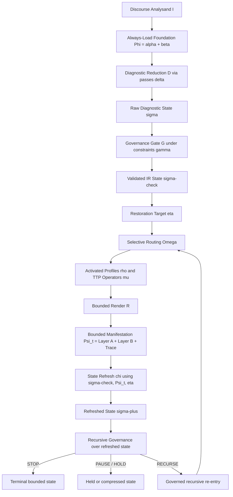

> role: canonical pipeline audit chart - single-surface view of the governed interpretive machine
> use when: auditing the decision circuit; surfacing where a response went wrong; checking that the diagnostic IR gated dispatch rather than documenting it retrospectively; verifying no forbidden shortcut was taken
> do not use when: routing sequence is already clean and no audit work is needed
> output: single ASCII chart of the full canonical pipeline

# Framework Pipeline - Governed Interpretive Machine

(visual audit surface; not independent ground-truth - canonical files govern where they conflict)

```text
[USER INPUT / CLAIM / EXCERPT]
             |
             v
+----------------------------------------------+
| ALWAYS-LOAD BACKGROUND                       |
| terminology.md | case-library/INDEX.md       |
| module-codes.md | heuristics.md              |
+----------------------------------------------+
             |
             v
+----------------------------------------------+
| V1 DIAGNOSTIC GATE                           |
| "No module before case-state"                |
| listen -> classify -> form IR -> dispatch    |
+----------------------------------------------+
             |
             v
+----------------------------------------------+
| PHASE 1: LISTENING                           |
| - map noetic structure                       |
| - track anchor / warrant / affective weight  |
| - do NOT answer yet                          |
+----------------------------------------------+
             |
             v
+------------------------------------------------------------+
| PHASE 2: AXIS CLASSIFICATION + MANDATORY PASSES            |
|                                                            |
| CORE AXES (source -> emit):                                |
| A1  NS code         noetic-reading-checklist.md            |
| A2  DO-orient       discourse-orientation.md               |
| A3  Concealment     modes-of-concealment.md                |
| A4  Deformation     seven-deformations.md                  |
| A5  Claim-type      case-state-schema.md field             |
| A6  Reason-cat      reason-disambiguation.md [P-A]         |
|                                                            |
| CONDITIONAL OVERLAYS:                                      |
| O1  Claim-level     pattern-profiling.md when higher-order |
| O2  Pattern profile pattern-profiling.md when recurring PF |
|                                                            |
| MANDATORY PASSES - run in sequence:                        |
| [P-A] reason-disambiguation.md                             |
|       emit: reason-category (1-4) + routing gate           |
| [P-B] foreign-premise-detection.md                         |
|       emit: [Foreign Premise Detection] block              |
| [P-C] prophetic-discourse-neutralization.md                |
|       emit: semantic-neutralization mode or "none active"  |
| [P-D] arabic-backbone-predicates.md                        |
|       emit: active predicates or "none active"             |
|                                                            |
| Specialty markers surfaced here if present:                |
| kalamic / fitrah / RT pressure / usurpation type /         |
| causal-series / definition-capture / proof-grammar         |
+------------------------------------------------------------+
             |
             v
+------------------------------------------------------------+
| DIAGNOSTIC IR - FORMATION + DISPATCH GATE                  |
|                                                            |
| Compose IR from Phase 2 outputs.                           |
| Meta-level burdens clear here: if claim-level is not       |
| first-order, the governing higher-order owner must clear   |
| before first-order DO / RT dispatch.                       |
|                                                            |
| GATE CHECKS (all must pass before dispatch):               |
| 1. Mandatory minimum fields populated?                     |
| 2. Consistency rules pass?                                 |
| 3. routing-precedence.md suppression rules S-1..S-7?       |
| 4. P7 stops checked?                                       |
| 5. Architectural integrity check passed?                   |
| 6. Concealment x orientation matrix permits content now?   |
|                                                            |
| *** Module dispatch is BLOCKED until all 6 checks pass *** |
+------------------------------------------------------------+
             |
       +-----+-----+
       |           |
       v           v
+-------------+  +-----------------------------------------------+
| GATE BLOCKED|  | GATE OPEN                                     |
|             |  |                                               |
| P7 stops,   |  | Routing-precedence levels 1-10 applied.       |
| semantic    |  | Case-state-justified coordination only.       |
| blockers,   |  |                                               |
| or register |  | MATCHED MODULE ENTRY:                         |
| holds block |  | Techniques: V2/V3/V5/V8/V9/V10/V12...         |
| or compress |  | Tactics: M1-M9 / E1-E4 / F1-F3 / R1-R3        |
| Layer B.    |  | Procedures: P1-P6                             |
| Layer A     |  | Case files: NS/DO/RT on confirmed match only  |
| stays live. |  |                                               |
+-------------+  +-----------------------------------------------+
       |                       |
       +----------+------------+
                  |
                  v
+------------------------------------------------------------+
| OUTPUT GOVERNANCE                                          |
| - Layer A: complete diagnostic output retained             |
| - Layer B: deployable engagement only if gate permits      |
| - Case-state / Source Basis rendered from validated IR     |
| - Claim-level / pattern-profile emitted only when live     |
| - Inference-boundary markers kept distinct                 |
| - Diagnostic IR remains the auditable gate record          |
| - Source-weight/status kept distinct                       |
| - Do not advertise unused modules or future stacks         |
+------------------------------------------------------------+
                  |
                  v
+------------------------------------------------------------+
| RESTORATION TRACE                                          |
| - Governing misread risk                                   |
| - What was withheld and why                                |
| - What correction was applied                              |
| - Route that became permissible after correction           |
| - What remains live / unresolved                           |
+------------------------------------------------------------+
                  |
                  v
+------------------------------------------------------------+
| BOTTOM-LINE SYNTHESIS / NEXT MOVE                          |
| - Conclusion relative to restored order                    |
| - One actionable next move                                 |
| - No maximal layering after a landed move                  |
| - Stop if next step would overpress or outrun the case     |
+------------------------------------------------------------+
```

## Selective Deployment Branch

Certain slogan families require a selective deployment branch inside the same mandatory-pass
architecture, especially PF-2 / P6 worldview-deflection and pseudo-neutrality cases:
"I have no religion," "I just follow the evidence," "I'm neutral," "I'm just following
reason," or "I looked and just wasn't convinced" when the slogan is functioning as an
already-installed tribunal rather than a formed inquiry.

Run the full Phase 2 stack and form the full IR exactly as usual. Then, if the case-state
shows reason-category 3 or 4 together with foreign premise / tribunal installation and a
live concealment or register-control read, keep the whole diagnosis in Layer A while
compressing Layer B to one bounded question or minimal tribunal-clearing. This branch exists
to preserve memetic precision and avoid rewarding deflection with over-disclosure; it is not
a shortcut around the diagnostic gate.

## Forbidden Shortcut Paths

- `[INPUT] -> [direct doctrinal rebuttal]`
  Bypasses V1 and the diagnostic IR gate entirely.
- `[philosophical vocabulary appears] -> [auto-load sound-reason-epistemology.md]`
  Turns non-default substrate into ambient default.
- `[grief / wound / identity-perf] -> [argument / theodicy / doctrinal counter]`
  Violates P7 Stop-1 and the concealment x orientation matrix.
- `[thin basis / one sentence] -> [confident motive read or family lock]`
  Violates underdetermined discipline and Stop-4.
- `[RT pressure appears] -> [broad doctrinal rebuttal first]`
  Skips V10 transmission vetting and the FPD pass.
- `[landed move] -> [stack next argument immediately]`
  Violates Stop-2.
- `[IR formed retrospectively] -> [counts as gate pass]`
  IR written after dispatch is cosmetic compliance.
- `[usurpation visible] -> [defend revelation within usurping framework]`
  Grants tribunal jurisdiction.
- `[backbone predicate trigger present] -> ["none active" emitted without checking]`
  Uses the compression rule as a bypass.
- `[semantic neutralization / loaded anti-attribute term] -> [release doctrinal content anyway]`
  Bypasses the `semantic-discipline-required` gate; clear recontenting, evacuation, or the lexical trap first.

## Formal Operator View

The ASCII chart above remains the primary audit surface. The formal view below makes the same
governed interpretive framework explicit in compact form. It does not replace repo-native routing
language, and it does not reduce the ontology to a pure graph. It states where discourse is
formalized, validated, manifested, refreshed, and re-entered.

Let the always-load foundation be:

$$
\Phi = \{\alpha,\beta\}
$$

where `\alpha` names the kernel commitments and `\beta` names the always-load substrate.

For each governed pass `t`, the framework can be stated as:

$$
\sigma_t = D(I_t, \Phi; \delta)
$$

$$
\sigma_t^{\checkmark} = G(\sigma_t \mid \gamma)
$$

$$
\eta_t = \operatorname{Target}(\sigma_t^{\checkmark})
$$

$$
(\rho_t,\mu_t) = \Omega(\sigma_t^{\checkmark}, \eta_t)
$$

$$
\Psi_t = \mathcal{R}(\rho_t,\mu_t,\sigma_t^{\checkmark},\eta_t)
= \langle \lambda_{A,t}, \lambda_{B,t}, \tau_t \rangle
$$

$$
\sigma_{t+1} = \chi(\sigma_t^{\checkmark}, \Psi_t, \eta_t)
$$

$$
\kappa(\sigma_{t+1}, \eta_t) \in \{\texttt{STOP}, \texttt{PAUSE}, \texttt{RECURSE}\}
$$

This is the quantized general framework in repo-native form: diagnostic reduction, governance,
restoration targeting, selective routing, bounded manifestation, state refresh, and governed
re-entry.

### Symbol Legend

| Symbol | Repo-native meaning |
|--------|---------------------|
| `I_t` | current discourse analysand for the pass |
| `\Phi` | always-load foundation carried into the pass |
| `\alpha` | kernel commitments / non-negotiable architecture |
| `\beta` | always-load substrate: terminology, indices, heuristics, and standing background |
| `D` | diagnostic reduction through V1 and the mandatory passes |
| `\delta` | the ordered pass family extracting the live state |
| `\sigma_t` | raw diagnostic state before validation |
| `G` | governance / validation gate |
| `\gamma` | routing precedence, stops, semantic discipline, register constraints, and related hard rails |
| `\sigma_t^{\checkmark}` | validated actionable IR state |
| `\eta_t` | live restoration target named from the validated state |
| `\Omega` | selective routing / owner activation |
| `\rho_t` | activated routed profile set |
| `\mu_t` | activated TTP operator set |
| `\mathcal{R}` | bounded render under current permissions |
| `\Psi_t` | bounded manifestation for the pass |
| `\lambda_A` | Layer A retained diagnosis |
| `\lambda_B` | Layer B deployable move |
| `\tau_t` | restoration trace for the pass |
| `\chi` | refreshed-state update after bounded manifestation |
| `\kappa` | recursive governance output: stop, pause, or recurse |

## Recursive State-Transition View

The framework is not a one-shot pipeline. Each pass produces bounded manifestation first, then
refreshes state. Only the refreshed state may authorize further release. `STOP` and `PAUSE` are
governed output states, not empty terminals. `RECURSE` means governed re-entry over the
still-live burden, not autonomous looping.



In operator terms, the route does not become recursive because the system keeps talking. It
becomes recursive only when a bounded move has landed, the state has refreshed, the restoration
target remains unmet, and governance still permits another pass.

## Noetic Structure and Meta-Noetic Memetics

Noetic structure is the object of diagnosis. It is not merely a list of claims or a worldview
label. It is the operative configuration of commitments, grounding relations, inferential norms,
testimonial posture, interpretive filters, stabilization structure, and routing-relevant
dependencies by which a case is actually being carried. Those grounding relations are often
graph-like, and locally may be read in DAG-like form, but the live control surface is richer
than a pure graph because it must also carry weighting, suppression, underdetermination,
concealment, and release conditions.

Meta-noetic memetics names the dynamic behavior of semantic-intellectual units within and around
that structure. It does not replace the repo's existing distinctions around concealment,
criterion-smuggling, semantic capture, tribunal importation, or defensive stabilization; it
clarifies how those already-named dynamics dock, persist, mutate, and propagate. It therefore is
not enough to know that a node is present. The operator must also read why it is present, how it
is being held in place, and what downstream dependencies will fail if a load-bearing premise,
criterion, or authority node is cleared.

The DSL-IR is the canonical audited formalization layer where those readings become governable.
It is the repo's audited control surface for routing, release permission, restoration trace, and
refreshed recursive eligibility. It is not decorative metadata and it is not retrospective
paperwork.

## Interpretive Note

The framework does not treat discourse as a blob to ingest and answer in one pass. It treats
discourse as an external analysand that can be inspected, decomposed, routed, manifested in
bounded form, and revisited under refreshed governance. That clarification does not rename the
repo into another vocabulary; it simply makes explicit what route-first discipline, DSL-IR
governance, and refreshed-state continuation already require.

The operative success condition is restorative structural viability: a noetic configuration whose
grounding, routing, release, and recursive continuation remain ordered toward restoration rather
than tribunal capture, semantic trap, memetic persistence, or brittle pseudo-stability.
