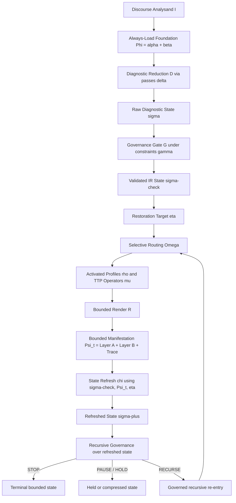

# Framework Pipeline - Governed Interpretive Machine

(visual audit surface; not independent ground-truth - canonical files govern where they conflict)

```text
[USER INPUT / CLAIM / EXCERPT]
             |
             v
+----------------------------------------------+
| ALWAYS-LOAD BACKGROUND                       |
| terminology.md | case-library/INDEX.md       |
| module-codes.md | heuristics.md              |
+----------------------------------------------+
             |
             v
+----------------------------------------------+
| V1 DIAGNOSTIC GATE                           |
| "No module before case-state"                |
| listen -> classify -> form IR -> dispatch    |
+----------------------------------------------+
             |
             v
+----------------------------------------------+
| PHASE 1: LISTENING                           |
| - map noetic structure                       |
| - track anchor / warrant / affective weight  |
| - do NOT answer yet                          |
+----------------------------------------------+
             |
             v
+------------------------------------------------------------+
| PHASE 2: AXIS CLASSIFICATION + MANDATORY PASSES            |
|                                                            |
| CORE AXES (source -> emit):                                |
| A1  NS code         noetic-reading-checklist.md            |
| A2  DO-orient       discourse-orientation.md               |
| A3  Concealment     modes-of-concealment.md                |
| A4  Deformation     seven-deformations.md                  |
| A5  Claim-type      case-state-schema.md field             |
| A6  Reason-cat      reason-disambiguation.md [P-A]         |
|                                                            |
| CONDITIONAL OVERLAYS:                                      |
| O1  Claim-level     pattern-profiling.md when higher-order |
| O2  Pattern profile pattern-profiling.md when recurring PF |
|                                                            |
| MANDATORY PASSES - run in sequence:                        |
| [P-A] reason-disambiguation.md                             |
|       emit: reason-category (1-4) + routing gate           |
| [P-B] foreign-premise-detection.md                         |
|       emit: [Foreign Premise Detection] block              |
| [P-C] prophetic-discourse-neutralization.md                |
|       emit: semantic-neutralization mode or "none active"  |
| [P-D] arabic-backbone-predicates.md                        |
|       emit: active predicates or "none active"             |
|                                                            |
| Specialty markers surfaced here if present:                |
| kalamic / fitrah / RT pressure / usurpation type /         |
| causal-series / definition-capture / proof-grammar         |
+------------------------------------------------------------+
             |
             v
+------------------------------------------------------------+
| DIAGNOSTIC IR - FORMATION + DISPATCH GATE                  |
|                                                            |
| Compose IR from Phase 2 outputs.                           |
| Meta-level burdens clear here: if claim-level is not       |
| first-order, the governing higher-order owner must clear   |
| before first-order DO / RT dispatch.                       |
|                                                            |
| GATE CHECKS (all must pass before dispatch):               |
| 1. Mandatory minimum fields populated?                     |
| 2. Consistency rules pass?                                 |
| 3. routing-precedence.md suppression rules S-1..S-7?       |
| 4. P7 stops checked?                                       |
| 5. Architectural integrity check passed?                   |
| 6. Concealment x orientation matrix permits content now?   |
|                                                            |
| *** Module dispatch is BLOCKED until all 6 checks pass *** |
+------------------------------------------------------------+
             |
       +-----+-----+
       |           |
       v           v
+-------------+  +-----------------------------------------------+
| GATE BLOCKED|  | GATE OPEN                                     |
|             |  |                                               |
| P7 stops,   |  | Routing-precedence levels 1-10 applied.       |
| semantic    |  | Case-state-justified coordination only.       |
| blockers,   |  |                                               |
| or register |  | MATCHED MODULE ENTRY:                         |
| holds block |  | Techniques: V2/V3/V5/V8/V9/V10/V12...         |
| or compress |  | Tactics: M1-M9 / E1-E4 / F1-F3 / R1-R3        |
| Layer B.    |  | Procedures: P1-P6                             |
| Layer A     |  | Case files: NS/DO/RT on confirmed match only  |
| stays live. |  |                                               |
+-------------+  +-----------------------------------------------+
       |                       |
       +----------+------------+
                  |
                  v
+------------------------------------------------------------+
| OUTPUT GOVERNANCE                                          |
| - Layer A: complete diagnostic output retained             |
| - Layer B: deployable engagement only if gate permits      |
| - Case-state / Source Basis rendered from validated IR     |
| - Claim-level / pattern-profile emitted only when live     |
| - Inference-boundary markers kept distinct                 |
| - Diagnostic IR remains the auditable gate record          |
| - Source-weight/status kept distinct                       |
| - Do not advertise unused modules or future stacks         |
+------------------------------------------------------------+
                  |
                  v
+------------------------------------------------------------+
| OUTPUT-RELEASE RUBRIC                                      |
| Checks (run after gate-open, before render):               |
| - Governing burden identified?                             |
| - All live upstream blockers cleared?                      |
| - Held material is held — not answered, not permanent?     |
| - Recursive traversal ordered, bounded, refreshed?         |
| - Release amount: not too much, not too little?            |
| - Stop / hold / recurse decision grounded in refreshed IR? |
| Held means traversal-delayed, not response-delayed.        |
+------------------------------------------------------------+
                  |
                  v
+------------------------------------------------------------+
| DIAGNOSTIC RENDER CONTRACT                                 |
| Level 1 — Ordinary bounded response                        |
| Level 2 — Compact diagnostic / lab-report                  |
| Level 3 — Full diagnostic / audit render                   |
| Render level selected from case-state + user signal.       |
| Render shape does not determine routing.                   |
+------------------------------------------------------------+
                  |
                  v
+------------------------------------------------------------+
| RESTORATION TRACE                                          |
| - Governing misread risk                                   |
| - What was withheld and why                                |
| - What correction was applied                              |
| - Route that became permissible after correction           |
| - What remains live / unresolved                           |
+------------------------------------------------------------+
                  |
                  v
+------------------------------------------------------------+
| BOTTOM-LINE SYNTHESIS / NEXT MOVE                          |
| - Conclusion relative to restored order                    |
| - One actionable next move                                 |
| - No maximal layering after a landed move                  |
| - Stop if next step would overpress or outrun the case     |
+------------------------------------------------------------+
```

## Selective Deployment Branch

Certain slogan families require a selective deployment branch inside the same mandatory-pass
architecture, especially PF-2 / P6 worldview-deflection and pseudo-neutrality cases:
"I have no religion," "I just follow the evidence," "I'm neutral," "I'm just following
reason," or "I looked and just wasn't convinced" when the slogan is functioning as an
already-installed tribunal rather than a formed inquiry.

Run the full Phase 2 stack and form the full IR exactly as usual. Then, if the case-state
shows reason-category 3 or 4 together with foreign premise / tribunal installation and a
live concealment or register-control read, keep the whole diagnosis in Layer A while
compressing Layer B to one bounded question or minimal tribunal-clearing. This branch exists
to preserve memetic precision and avoid rewarding deflection with over-disclosure; it is not
a shortcut around the diagnostic gate.

## Forbidden Shortcut Paths

- `[INPUT] -> [direct doctrinal rebuttal]`
  Bypasses V1 and the diagnostic IR gate entirely.
- `[philosophical vocabulary appears] -> [auto-load sound-reason-epistemology.md]`
  Turns non-default substrate into ambient default.
- `[grief / wound / identity-perf] -> [argument / theodicy / doctrinal counter]`
  Violates P7 Stop-1 and the concealment x orientation matrix.
- `[thin basis / one sentence] -> [confident motive read or family lock]`
  Violates underdetermined discipline and Stop-4.
- `[RT pressure appears] -> [broad doctrinal rebuttal first]`
  Skips V10 transmission vetting and the FPD pass.
- `[landed move] -> [stack next argument immediately]`
  Violates Stop-2.
- `[IR formed retrospectively] -> [counts as gate pass]`
  IR written after dispatch is cosmetic compliance.
- `[usurpation visible] -> [defend revelation within usurping framework]`
  Grants tribunal jurisdiction.
- `[backbone predicate trigger present] -> ["none active" emitted without checking]`
  Uses the compression rule as a bypass.
- `[semantic neutralization / loaded anti-attribute term] -> [release doctrinal content anyway]`
  Bypasses the `semantic-discipline-required` gate; clear recontenting, evacuation, or the lexical trap first.
- `[downstream content detected] -> [held but never reassessed after blocker clears]`
  Treats held as permanent suppression rather than traversal-delayed.
- `[held = wait for user reply] -> [no same-response recursion ever]`
  State refresh is an internal operation; it may occur inside the same response.
- `[recursive traversal permitted] -> [argument dump at one refresh]`
  Recursion is door-by-door, not total-downstream release at one state refresh.
- `[diagnostic transparency allowed] -> [machinery dump]`
  Diagnostic render eligibility does not suspend output-release rubric.
- `[source-audit-derived topic appears] -> [argument bank / citation dump]`
  External source-audit material supplies structural framing only. It does not bypass IR formation, source-use discipline, owner selection, or release limits.
- `[tradition label appears] -> [tradition-specific answer]`
  "Jewish", "Hindu", "Sufi", or "Buddhist" is not itself a route. Type the load-bearing node first: authority order, criterion, semantic hinge, category-set, identity wound, or transmission layer.
- `[pattern print emitted] -> [PF / routing precedence bypassed]`
  Structural pattern print is an optional IR descriptor, not a new V-pass, PF replacement, or coverage claim.

Compact pipeline (rubric/render placement):
`IR → PF/claim-level → owners → TTP → load floor → release rubric → render contract → bounded output → refreshed state → stop/hold/recurse`

## Recursive State-Transition View

**Canonical owner:** This section is the authoritative definition of the STOP / PAUSE / RECURSE
state model. All other files that govern recursive continuation (`SKILL.md §V.D`,
`diagnostic-ir.md §Current-pass activation rule`, `routing-precedence.md Rule P-3`,
`anti-patterns.md §False Landing`) cross-reference this section rather than re-stating the model
independently. `P7-restoration-stops.md` is the concrete instantiation of the PAUSE / STOP
states (Stops 1–5); this section owns the abstract state-transition semantics.

The framework is not a one-shot pipeline. Each pass produces bounded manifestation first, then
refreshes state. Only the refreshed state may authorize further release. `STOP` and `PAUSE` are
governed output states, not empty terminals. `RECURSE` means governed re-entry over the
still-live burden, not autonomous looping.



In operator terms, the route does not become recursive because the system keeps talking. It
becomes recursive only when a bounded move has landed, the state has refreshed, the restoration
target remains unmet, and governance still permits another pass.

## Noetic Structure and Meta-Noetic Memetics

**Canonical owner:** This section is the authoritative definition of noetic structure and
meta-noetic memetics as they function in this architecture. Files that engage the dynamics
of criterion-docking, tribunal-installation, semantic-capture persistence, defensive
stabilization, and collapse-radius should cross-reference this section rather than
re-stating the conceptual framework independently. The DSL-IR operationalization of these
dynamics lives in `references/diagnostics/diagnostic-ir.md §DSL-IR as Audited Formalization
Layer`. This section names the conceptual architecture; that file makes it actionable.

Noetic structure is the object of diagnosis. It is not merely a list of claims or a worldview
label. It is the operative configuration of commitments, grounding relations, inferential norms,
testimonial posture, interpretive filters, stabilization structure, and routing-relevant
dependencies by which a case is actually being carried. Those grounding relations are often
graph-like, and locally may be read in DAG-like form, but the live control surface is richer
than a pure graph because it must also carry weighting, suppression, underdetermination,
concealment, and release conditions.

Meta-noetic memetics names the dynamic behavior of semantic-intellectual units within and around
that structure. It does not replace the repo's existing distinctions around concealment,
criterion-smuggling, semantic capture, tribunal importation, or defensive stabilization; it
clarifies how those already-named dynamics dock, persist, mutate, and propagate. It therefore is
not enough to know that a node is present. The operator must also read why it is present, how it
is being held in place, and what downstream dependencies will fail if a load-bearing premise,
criterion, or authority node is cleared.

The DSL-IR is the canonical audited formalization layer where those readings become governable.
For the authoritative definition of what the DSL-IR is, its gate protocol, field rules, and
failure tests, see `references/diagnostics/diagnostic-ir.md §DSL-IR as Audited Formalization
Layer`. That file is the canonical prose owner; this section names the pipeline surface where
the IR sits.

## Interpretive Note

The framework does not treat discourse as a blob to ingest and answer in one pass. It treats
discourse as an external analysand that can be inspected, decomposed, routed, manifested in
bounded form, and revisited under refreshed governance. That clarification does not rename the
repo into another vocabulary; it simply makes explicit what route-first discipline, DSL-IR
governance, and refreshed-state continuation already require.

The operative success condition is restorative structural viability: a noetic configuration whose
grounding, routing, release, and recursive continuation remain ordered toward restoration rather
than tribunal capture, semantic trap, memetic persistence, or brittle pseudo-stability.

For the canonical definition of the Diagnostic IR, see `references/diagnostics/diagnostic-ir.md`.

## Formal Operator View

The ASCII chart above remains the primary audit surface. The formal view below makes the same
governed interpretive framework explicit in compact form. It does not replace repo-native routing
language, and it does not reduce the ontology to a pure graph. It states where discourse is
formalized, validated, manifested, refreshed, and re-entered.

Let the always-load foundation be:

$$
\Phi = \{\alpha,\beta\}
$$

where `\alpha` names the kernel commitments and `\beta` names the always-load substrate.

For each governed pass `t`, the framework can be stated as:

$$
\sigma_t = D(I_t, \Phi; \delta)
$$

$$
\sigma_t^{\checkmark} = G(\sigma_t \mid \gamma)
$$

$$
\eta_t = \operatorname{Target}(\sigma_t^{\checkmark})
$$

$$
(\rho_t,\mu_t) = \Omega(\sigma_t^{\checkmark}, \eta_t)
$$

$$
\Psi_t = \mathcal{R}(\rho_t,\mu_t,\sigma_t^{\checkmark},\eta_t)
= \langle \lambda_{A,t}, \lambda_{B,t}, \tau_t \rangle
$$

$$
\sigma_{t+1} = \chi(\sigma_t^{\checkmark}, \Psi_t, \eta_t)
$$

$$
\kappa(\sigma_{t+1}, \eta_t) \in \{\texttt{STOP}, \texttt{PAUSE}, \texttt{RECURSE}\}
$$

This is the quantized general framework in repo-native form: diagnostic reduction, governance,
restoration targeting, selective routing, bounded manifestation, state refresh, and governed
re-entry.

### Symbol Legend

| Symbol | Repo-native meaning |
|---|---|
| I<sub>t</sub> | current discourse analysand for the pass |
| Φ | always-load foundation carried into the pass |
| α | kernel commitments / non-negotiable architecture |
| β | always-load substrate: terminology, indices, heuristics, and standing background |
| D | diagnostic reduction through V1 and the mandatory passes |
| δ | the ordered pass family extracting the live state |
| σ<sub>t</sub> | raw diagnostic state before validation |
| G | governance / validation gate |
| γ | routing precedence, stops, semantic discipline, register constraints, and related hard rails |
| σ<sub>t</sub><sup>✓</sup> | validated actionable IR state |
| η<sub>t</sub> | live restoration target named from the validated state |
| Ω | selective routing / owner activation |
| ρ<sub>t</sub> | activated routed profile set |
| μ<sub>t</sub> | activated TTP operator set |
| ℛ | bounded render under current permissions |
| Ψ<sub>t</sub> | bounded manifestation for the pass |
| λ<sub>A</sub> | Layer A retained diagnosis |
| λ<sub>B</sub> | Layer B deployable move |
| τ<sub>t</sub> | restoration trace for the pass |
| χ | refreshed-state update after bounded manifestation |
| κ | recursive governance output: stop, pause, or recurse |

The ASCII chart, recursive state-transition view, and Mermaid graph above remain the primary audit
surfaces. The formal view below makes the same governed interpretive framework explicit in operator
form. It does not replace repo-native routing language, and it does not reduce the ontology to a
pure graph. It identifies where discourse is formalized, validated, selectively activated,
manifested under bounded permissions, refreshed, and re-entered under governance.

At the highest level, the framework is not a one-shot router. It is a governed selective-recursive
diagnostic architecture whose continuation is rejudged after every bounded move.

### Global Operator

Let the total system be:

```math
\hat{\mathcal{S}}_{\eta,\kappa}
=
\mathrm{Iterate}_{\kappa,\eta}
\Big[
\chi
\circ
\mathcal{R}
\circ
\Omega
\circ
G
\circ
D
\Big]
```

Applied to raw discourse `I` under the always-load foundation `Φ`:

```math
\Psi^{*}
=
\hat{\mathcal{S}}_{\eta,\kappa}(I,\Phi)
```

Here, `Ψ*` is the final bounded restorative output across one or more governed rounds.
The composition reads right-to-left: D first, then G, then Ω, then ℛ, then χ — matching
the execution order in §Functional Pipeline (steps II through VI).

This makes explicit that the framework is not a free-running recursion engine and not a static
routing table. It is a stateful iterative operator whose continuation is governed after each landed
move.

### Symbol Legend

#### Foundation Layer

```math
\Phi = \{\alpha,\beta\}
```

where:

```math
\alpha = \{\texttt{KERNEL},\texttt{META},\texttt{WAHY}\}
\qquad
\beta = \{\texttt{TERM},\texttt{HEUR},\texttt{CASEINDEX}\}
```

* `α`: kernel commitments / governing anchors
* `β`: always-load substrate: terminology, heuristics, case indexing, and standing background

#### Diagnostic Layer

The discourse is first bound to the governing foundation:

```math
S_0 = I \otimes (\alpha + \beta)
```

Diagnostic reduction then maps governed input into raw diagnostic state:

```math
\sigma_t = D(S_t;\delta)
```

Here, `δ` names the ordered diagnostic pass family extracting the live state, including the
noetic, orientation, deformation, reason, foreign-premise, prophetic-discourse, and backbone checks
as governed by the canonical diagnostics.

#### Governance Layer

Validation and suppression are then applied:

```math
\sigma_t^{\checkmark} = G(\sigma_t \mid \gamma)
```

Here, `γ` names the hard rails carried by routing precedence, stops, semantic discipline,
register constraints, and related governance checks.

This is not merely a transition from possible to actual. It is a transition from possible to
permitted.

#### Routing Layer

From the validated state, the live restoration target is selected:

```math
\eta_t = \mathrm{Target}(\sigma_t^{\checkmark})
```

Selective routing then activates only the profiles and operator surfaces justified by the current
validated state and restoration target:

```math
(\rho_t,\mu_t) = \Omega(\sigma_t^{\checkmark},\eta_t)
```

where:

* `ρ_t`: activated routed profile set
* `μ_t`: activated TTP operator set

Routing is therefore state-conditioned, not merely topic-conditioned.

#### Bounded Manifestation Layer

Bounded manifestation is rendered under current permissions:

```math
\Psi_t =
\mathcal{R}(\rho_t,\mu_t,\sigma_t^{\checkmark},\eta_t)
=
\langle \lambda_{A,t}, \lambda_{B,t}, \tau_t \rangle
```

where:

* `λ_A,t`: Layer A retained diagnosis
* `λ_B,t`: Layer B deployable move
* `τ_t`: restoration trace for the pass

This makes explicit that the framework does not emit undifferentiated output. It renders retained
diagnosis, deployable engagement, and restoration trace under bounded permissions.

#### Recursive Layer

After each bounded manifestation, refreshed state is computed:

```math
\sigma_{t+1}^{+} = \chi(\sigma_t^{\checkmark},\Psi_t,\eta_t)
```

Recursive governance then determines whether the framework stops, pauses, or re-enters:

```math
\kappa(\sigma_{t+1}^{+},\Psi_t,\eta_t)
\in
\{\texttt{STOP},\texttt{PAUSE},\texttt{RECURSE}\}
```

If recursive re-entry is licensed, the next pass begins from refreshed state under renewed
governance rather than from unguided carry-forward:

```math
S_{t+1} = \sigma_{t+1}^{+} \otimes \Phi
```

Bounded deployment therefore governs how recursion unfolds; it does not abolish recursion.

**State Carry Table** — what χ retains, resets, and re-evaluates across a pass boundary:

| State component | Carry rule |
|----------------|------------|
| NS code, deformation, concealment mode, DO-orient | **Carried** — stable diagnostic read persists until a fresh differentiating signal changes it |
| Restoration target η | **Carried** if still unmet; **updated** if the landed move partially resolved it |
| Alignment state, Recognition strength | **Carried as-is** — these progress across passes; they do not reset |
| `What remains live` differentiators | **Carried** as the live input to the next V1 opening |
| Matched modules (ρ_t, μ_t) | **Reset** — re-derived from refreshed state; not carried from the prior pass |
| Layer B content (λ_{B,t}) | **Reset** — re-derived from refreshed state |
| Next move | **Reset** — re-derived from refreshed state |
| Continuation eligibility | **Re-evaluated fresh** from the refreshed state; not inherited from the prior pass |

The prose governance for these rules is distributed across `diagnostic-ir.md §Current-pass
activation rule` (matched modules reset, boundary reset after Stop-2) and
`diagnostic-ir.md §Acceptance-state rules` (alignment/recognition progression). This table
is the single consolidated reference for the carry semantics of χ.

### Functional Pipeline

#### I. Initialization

```math
S_0 = I \otimes (\alpha + \beta)
```

Raw discourse is bound to governing anchors and substrate.

```math
\text{raw} \to \text{governed}
```

#### II. Diagnostic Reduction

```math
\sigma_0 = D(S_0;\delta)
```

The discourse is reduced into diagnostic markers and structured state.

```math
\text{subjective} \to \text{classified}
```

#### III. Gated Validation

```math
\sigma_0^{\checkmark} = G(\sigma_0 \mid \gamma)
```

The state is checked against routing precedence, anti-pattern discipline, stop conditions, semantic
holds, register holds, and related hard rails.

```math
\text{possible} \to \text{permitted}
```

#### IV. Selective Routing

```math
(\rho_0,\mu_0) = \Omega(\sigma_0^{\checkmark},\eta_0)
```

Only the live profiles and TTP surfaces are activated.

```math
\text{available} \to \text{selected}
```

#### V. Bounded Manifestation

```math
\Psi_0
=
\mathcal{R}(\rho_0,\mu_0,\sigma_0^{\checkmark},\eta_0)
=
\langle \lambda_{A,0}, \lambda_{B,0}, \tau_0 \rangle
```

Output is rendered under current permissions, not from total available knowledge.

```math
\text{selected} \to \text{manifest}
```

#### VI. Refreshed Recursive Decision

After a landed move:

```math
\sigma_1^{+} = \chi(\sigma_0^{\checkmark},\Psi_0,\eta_0)
```

Then:

```math
\kappa(\sigma_1^{+},\Psi_0,\eta_0)
\in
\{\texttt{STOP},\texttt{PAUSE},\texttt{RECURSE}\}
```

If recursive re-entry is licensed:

```math
S_1 = \sigma_1^{+} \otimes \Phi
```

and the cycle proceeds only under renewed governance.

### TTPs as Selective Recursive Operators

The routed TTP layer is not merely a list of response modules. Each active TTP functions as a
bounded state-conditioned operator ordered toward the current restoration target.

Let `T_i ∈ μ_t`. Then:

```math
T_i : (\sigma_t^{\checkmark},\eta_t) \to \Delta\Psi_t
```

Meaning:

* a TTP acts only on validated current state,
* it produces a bounded delta in manifestation,
* it remains ordered toward a restoration target rather than free expansion.

So a governed pass may be extended as:

```math
\Psi_{t+1} = \Psi_t \oplus \Delta\Psi_t
\qquad
\text{where}
\qquad
\Delta\Psi_t = T_i(\sigma_t^{\checkmark},\eta_t)
```

But continuation remains governed by refreshed state:

```math
\kappa(\chi(\sigma_t^{\checkmark},\Psi_t,\eta_t),\Psi_t,\eta_t)
```

This makes explicit that TTPs are selective recursive operators whose continuation is judged only
after refresh. They are not autonomous chains and not ambient always-on expansions.

### State Taxonomy

To avoid conflating state levels, the framework distinguishes:

```math
\sigma_t
\qquad
\text{raw diagnostic state}
```

```math
\sigma_t^{\checkmark}
\qquad
\text{validated actionable state}
```

```math
\sigma_t^{+}
=
\chi(\sigma_t^{\checkmark},\Psi_t,\eta_t)
\qquad
\text{refreshed post-move state}
```

The architecture is therefore not a single collapse event. It is a sequence of temporary
stabilizations into actionable states under renewed governance.

### Layer Semantics

Canonical definition: `SKILL.md §V.A — Two-Layer Output Contract` is the governing prose
definition of Layer A and Layer B. The operator notation below is a compact formal summary of
the same distinction; it does not introduce independent semantics.

Layer A retains diagnostic truth-state for control integrity:

```math
\lambda_{A,t} = f_A(\sigma_t^{\checkmark})
```

Layer B manifests the deployable move under current permissions:

```math
\lambda_{B,t} = f_B(\sigma_t^{\checkmark},\eta_t,\gamma)
```

The restoration trace records the path of bounded restorative movement:

```math
\tau_t \subseteq
\{\sigma_t^{\checkmark} \to \Psi_t \to \sigma_{t+1}^{+}\}
```

So the output is not merely answer-content. It is diagnosis, bounded engagement, and restorative
trace under governance.

### State Transition Table

| Phase          | Input               | Operator | Output                 | Ontological shift       |
| -------------- | ------------------- | -------- | ---------------------- | ----------------------- |
| Initialization | `I`                 | `Φ`      | `S₀`                   | raw → governed          |
| Diagnosis      | `S₀`                | `D`      | `σ₀`                   | subjective → classified |
| Validation     | `σ₀`                | `G`      | `σ₀✓`                  | possible → permitted    |
| Routing        | `σ₀✓, η₀`           | `Ω`      | `(ρ₀, μ₀)`             | available → selected    |
| Rendering      | `(ρ₀, μ₀), σ₀✓, η₀` | `ℛ`      | `Ψ₀`                   | selected → manifest     |
| Refresh        | `σ₀✓, Ψ₀, η₀`       | `χ`      | `σ₁⁺`                  | manifest → updated      |
| Continuation   | `σ₁⁺, Ψ₀, η₀`       | `κ`      | stop / pause / recurse | updated → directed      |

### Compact Summary Equation

The full architecture may be stated compactly as:

```math
\Psi^{*}
=
\mathrm{Iterate}_{\kappa,\eta}
\Big[
\chi
\circ
\mathcal{R}
\circ
\Omega
\circ
G
\circ
D
\Big]
(I,\Phi)
```

subject to:

```math
\kappa(\sigma_t^{+},\Psi_t,\eta_t)
\in
\{\texttt{STOP},\texttt{PAUSE},\texttt{RECURSE}\}
```

and with each Layer B manifestation bounded by current permissions:

```math
\lambda_{B,t} \subseteq \mathrm{Permitted}(\sigma_t^{\checkmark},\gamma)
```

### Interpretive Conclusion

This formalization treats the framework not as a static pipeline, but as a governed
selective-recursive architecture:

* the Diagnostic IR is the actionable audited control surface;
* routing is selective activation from validated state;
* output is bounded manifestation, not unconstrained discharge;
* recursion is permitted only through refreshed state;
* TTPs are selective recursive operators rather than ambient expansion rules;
* the end is restorative structural viability, not mere contradiction-production.

In compact form:

$$
\text{Input}
\to
\text{Governed State}
\to
\text{Validated IR}
\to
$$
$$
\text{Selective TTP Activation}
\to
\text{Bounded Move}
\to
$$
$$
\text{Refreshed State}
\to
\text{Recurse / Pause / Stop}
$$

## Coverage Verification

- Failure condition: Any direct jump from user input to doctrinal rebuttal, retrospective IR formation after dispatch, or recursive dump after a landed move violates the pipeline.
- IR-visible consequence: The validated IR must precede owner activation, output release, render selection, and refreshed-state continuation.
- Minimal pair: A governed same-response recursion follows a landed move plus refresh plus renewed permission; an argument stack is merely accumulated downstream content without refreshed governance.
- Hold/release rule: The gate-blocked branch keeps Layer A live and compresses or withholds Layer B until stops, semantic blockers, or register holds clear.
- Anti-pattern guard: Do not treat the ASCII chart as a decorative report; it is an audit surface for whether the runtime dispatch order was obeyed.
